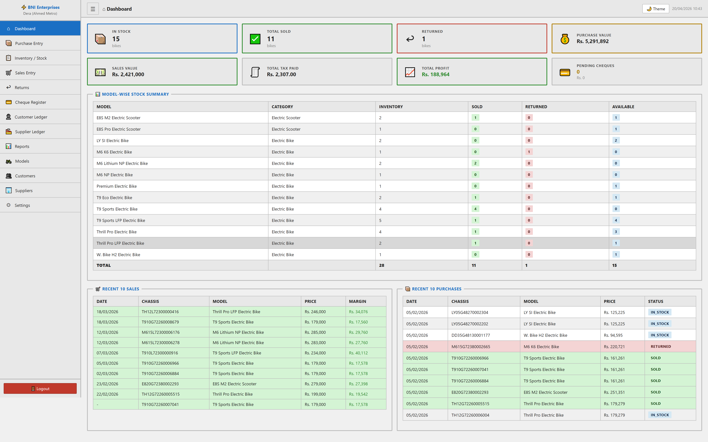
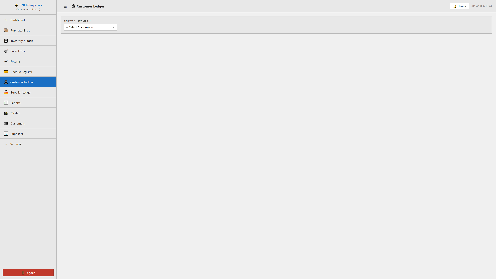
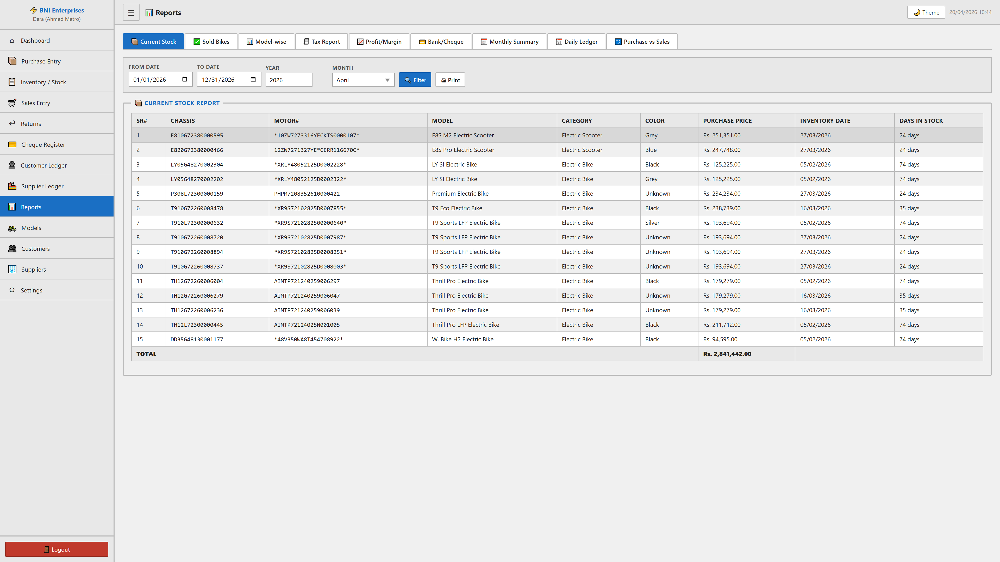
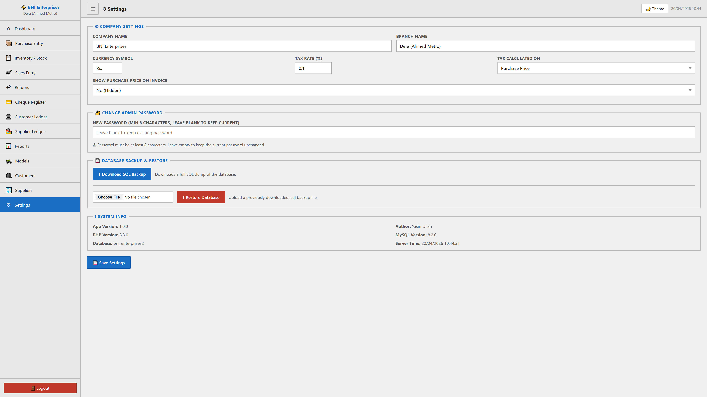

# BNI Enterprises: Bike Dealer Management System
## Official Comprehensive Documentation | آفیشل سسٹم دستاویزات اور یوزر مینول
**Version 2026.3 | ورژن 2026.3**

Welcome to the full functional guide for the **BNI Enterprises Bike Dealer Management System**. This document is designed for both management and clients to understand every single feature, module, and operational flow within the application.

یہ **بی این آئی انٹرپرائزز بائیک ڈیلر مینجمنٹ سسٹم** کے لیے مکمل فنکشنل گائیڈ ہے۔ یہ دستاویز انتظامیہ اور کلائنٹس دونوں کے لیے ڈیزائن کی گئی ہے تاکہ وہ ایپلی کیشن کے اندر موجود ہر فیچر، ماڈیول اور آپریشنل فلو کو مکمل طور پر سمجھ سکیں۔

---

## 📑 Table of Contents | فہرست
1. [Introduction | تعارف](#1-introduction--تعارف)
2. [Dashboard: Central Hub | ڈیش بورڈ: مرکزی مرکز](#2-dashboard-central-hub--ڈیش-بورڈ-مرکزی-مرکز)
3. [Purchase Management | خریداری کا انتظام](#3-purchase-management--خریداری-کا-انتظام)
4. [Inventory Control | اسٹاک کنٹرول](#4-inventory-control--اسٹاک-کنٹرول)
5. [Sales & Invoicing | سیلز اور انوائسنگ](#5-sales--invoicing--سیلز-اور-انوائسنگ)
6. [Returns & Refunds | واپسی اور ریفنڈ](#6-returns--refunds--واپسی-اور-ریفنڈ)
7. [Accounting & Ledgers | اکاؤنٹنگ اور کھاتہ جات](#7-accounting--ledgers--اکاؤنٹنگ-اور-کھاتہ-جات)
8. [Advanced Reporting | ایڈوانس رپورٹنگ](#8-advanced-reporting--ایڈوانس-رپورٹنگ)
9. [System Settings & Security | سسٹم کی ترتیبات اور سیکیورٹی](#9-system-settings--security--سسٹم-کی-ترتیبات-اور-سیکیورٹی)

---

## 1. Introduction | تعارف
**English:** BNI Enterprises is a specialized ERP solution for Electric Bike dealerships. It handles everything from bulk purchasing and stock maintenance to tax-compliant sales and automated accounting ledgers.
**Urdu:** بی این آئی انٹرپرائزز الیکٹرک بائیک ڈیلرشپ کے لیے ایک خصوصی ERP حل ہے۔ یہ بلک خریداری اور اسٹاک کی دیکھ بھال سے لے کر ٹیکس کے مطابق سیلز اور خودکار اکاؤنٹنگ لیجرز تک سب کچھ سنبھالتا ہے۔

---

## 2. Dashboard: Central Hub | ڈیش بورڈ: مرکزی مرکز
The Dashboard provides a 360-degree view of your business health.
ڈیش بورڈ آپ کے کاروبار کی صحت کا 360 ڈگری منظر فراہم کرتا ہے۔

**Features / خصوصیات:**
- **Real-time Stats:** Instant counts for Stock, Sold units, and Returns.
- **Financial Summary:** Total Purchase Value, Sales Value, Tax Paid, and Net Margin.
- **Model-wise Summary:** Detailed breakdown of inventory status for each specific bike model.
- **Recent Activities:** Lists the last 10 Sales and 10 Purchases for quick reference.

**اردو:** اسٹاک، فروخت شدہ یونٹس، اور واپسی کے فوری اعدادوشمار۔ کل خریداری کی قیمت، سیلز کی قیمت، ادا شدہ ٹیکس، اور خالص منافع کا خلاصہ۔ ہر بائیک ماڈل کے لیے اسٹاک کی صورتحال کی تفصیلی تفصیل۔ فوری حوالہ کے لیے آخری 10 سیلز اور 10 خریداریوں کی فہرست۔

---

## 3. Purchase Management | خریداری کا انتظام
This module records the intake of new stock and sets up the financial liability with suppliers.
یہ ماڈیول نئے اسٹاک کے اندراج کو ریکارڈ کرتا ہے اور سپلائرز کے ساتھ مالی واجبات کو ترتیب دیتا ہے۔

**Key Functionalities / اہم افعال:**
- **Order & Inventory Tracking:** Separate dates for when the order was placed vs. when it arrived.
- **Bulk Unit Entry:** Add multiple bikes in one go (Chassis, Motor, Model, Color, Price).
- **Chassis Validation:** Built-in check to prevent duplicate Chassis numbers.
- **Financial Linking:** Record Cheque/Bank details during purchase to update the Supplier Ledger.
- **Safeguard & Accessories:** Track what comes with the bike (Charger, Helmet, Warranty cards).

**اردو:** آرڈر اور انوینٹری کی تاریخوں کا الگ الگ ٹریکنگ۔ ایک ہی بار میں متعدد بائیکس (چیسس، موٹر، ماڈل، رنگ، قیمت) کا اندراج۔ چیسس نمبر کی نقل کو روکنے کے لیے بلٹ ان چیک۔ سپلائر لیجر کو اپ ڈیٹ کرنے کے لیے خریداری کے دوران چیک/بینک کی تفصیلات کا ریکارڈ۔ چارجر، ہیلمٹ، وارنٹی کارڈز وغیرہ کا اندراج۔

---

## 4. Inventory Control | اسٹاک کنٹرول
The master list of every asset in your dealership.
آپ کی ڈیلرشپ میں موجود ہر اثاثہ کی ماسٹر لسٹ۔

**Key Features / اہم خصوصیات:**
- **Status Badges:** Clearly see `In Stock`, `Sold`, `Returned`, or `Reserved`.
- **Deep Filtering:** Search by any parameter (Dates, Chassis, Color, Model).
- **History Timeline:** Every bike has its own timeline showing Purchase date -> Sale date -> Return date (if any).
- **Exporting:** Download your entire stock list as a CSV file for Excel analysis.

**اردو:** ان اسٹاک، فروخت شدہ، واپس یا ریزرو شدہ بائیکس کے لیے واضح بیجز۔ کسی بھی پیرامیٹر (تاریخوں، چیسس، رنگ، ماڈل) کے ذریعے تلاش کریں۔ ہر بائیک کا اپنا ٹائم لائن ہوتا ہے جو خریداری سے لے کر فروخت تک کی تفصیلات دکھاتا ہے۔ ایکسل تجزیہ کے لیے اپنی پوری اسٹاک لسٹ کو بطور CSV فائل ڈاؤن لوڈ کریں۔

---

## 5. Sales & Invoicing | سیلز اور انوائسنگ
Streamline the customer journey from inquiry to invoice.
گاہک کے سفر کو انکوائری سے انوائس تک ہموار بنائیں۔

**Process / طریقہ کار:**
- **Bike Selection:** Only `In Stock` bikes are available for selection.
- **Auto-Pricing:** Automatically shows Purchase Price to help you set the Selling Price.
- **Tax Engine:** Automatically calculates GST/Tax based on your system settings (0.1% etc).
- **Profit Margin:** Instantly shows the profit you are making on the sale.
- **Professional Invoice:** Print a clean, branded invoice for the customer with all technical details.

**اردو:** فروخت کے لیے صرف اسٹاک میں موجود بائیکس کا انتخاب۔ فروخت کی قیمت مقرر کرنے میں مدد کے لیے خودکار خریداری کی قیمت۔ سسٹم کی ترتیبات کی بنیاد پر ٹیکس کا خودکار حساب۔ سیل پر ہونے والے منافع کی فوری تفصیل۔ گاہک کے لیے تمام تکنیکی تفصیلات کے ساتھ برانڈڈ انوائس پرنٹ کریں۔

---

## 6. Returns & Refunds | واپسی اور ریفنڈ
Management of cancellations and product returns.
منسوخیوں اور مصنوعات کی واپسی کا انتظام۔

- **Audit Trail:** Links the return back to the original sale.
- **Refund Tracking:** Track if the money was returned via Cash or Cheque.
- **Automatic Stock Update:** Returning a bike immediately makes it `Returned` in inventory, ensuring correct counts.

**اردو:** واپسی کو اصل فروخت کے ساتھ لنک کرنا۔ نقد یا چیک کے ذریعے رقم کی واپسی کا ٹریک۔ بائیک واپس کرنے پر انوینٹری میں اسٹاک کا خودکار اپ ڈیٹ۔

---

## 7. Accounting & Ledgers | اکاؤنٹنگ اور کھاتہ جات
Complete visibility into your cash flow and liabilities.
آپ کے کیش فلو اور واجبات کی مکمل تفصیلات۔

- **Customer Ledger:** View every transaction, payment, and return for a specific customer with a running balance.
- **Supplier Ledger:** Manage payments to vendors and track balance owed.
- **Cheque Register:** A dedicated list of all post-dated and current cheques (Pending, Cleared, Bounced, or Cancelled).

**اردو:** رننگ بیلنس کے ساتھ کسی مخصوص گاہک کے لیے ہر لین دین اور ادائیگی دیکھیں۔ وینڈرز کو ادائیگیوں کا انتظام کریں اور واجب الادا بیلنس کو ٹریک کریں۔ تمام چیکس کی ایک وقف شدہ فہرست (زیر التواء، کلیئر، باؤنس، یا منسوخ)۔

---

## 8. Advanced Reporting | ایڈوانس رپورٹنگ
Data-driven insights for business growth.
کاروبار کی ترقی کے لیے ڈیٹا پر مبنی رپورٹس۔

- **Tax Report:** For tax filing compliance.
- **Profit/Margin Report:** Analyze which models are making the most profit.
- **Monthly Summary:** High-level overview of monthly growth.
- **Daily Ledger:** Detailed "Day Book" for daily operations.
- **Purchase vs Sales:** Visual and tabular comparison of money spent vs money earned.

**اردو:** ٹیکس فائلنگ کی تعمیل کے لیے ٹیکس رپورٹ۔ منافع کا تجزیہ کرنے کے لیے پرافٹ/مارجن رپورٹ۔ ماہانہ ترقی کا جائزہ۔ روزانہ کے آپریشنز کے لیے تفصیلی "ڈے بک"۔ خرچ کی گئی رقم بمقابلہ کمائی گئی رقم کا موازنہ۔

---

## 9. System Settings & Security | سسٹم کی ترتیبات اور سیکیورٹی
The backbone of the application.
ایپلی کیشن کی بنیاد۔

- **Branding:** Set your Company and Branch names for invoices.
- **Tax Policy:** Define your own tax percentages and calculation methods.
- **Data Protection:** Full Database Backup and Restore tools are built-in.
- **Theme Support:** Switch between Dark Mode and Light Mode for user comfort.

**اردو:** انوائسز کے لیے اپنی کمپنی اور برانچ کے نام سیٹ کریں۔ اپنے ٹیکس فیصد اور حساب کے طریقے خود ترتیب دیں۔ ڈیٹا بیس بیک اپ اور ری اسٹور کے ٹولز۔ بہتر تجربے کے لیے ڈارک موڈ اور لائٹ موڈ کے درمیان سوئچ کریں۔

---
*Generated by BNI Enterprises Audit System 2026.3 | بی این آئی انٹرپرائزز آڈٹ سسٹم*
