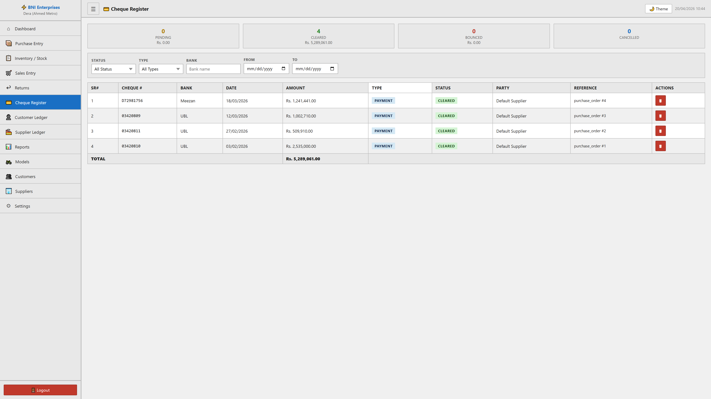

# Cheque Register Module

## Purpose
This module facilitates the manage of cheque register within the system. It allows for the tracking, reporting, and classification of critical business records.

## Form Fields & Controls
- **STATUS**: [select] - Standardized categorization dropdown.
- **TYPE**: [select] - Standardized categorization dropdown.
- **BANK**: [text] - Captures standardized information for records.
- **FROM**: [date] - Chronological tracking for historical reporting.
- **TO**: [date] - Chronological tracking for historical reporting.

## Data Architecture (Tables)
| SR# | CHEQUE # | BANK | DATE | AMOUNT | TYPE | STATUS | PARTY | REFERENCE | ACTIONS |
| --- | --- | --- | --- | --- | --- | --- | --- | --- | --- |
| 1 | D72981756 | Meezan | 18/03/2026 | Rs. 1,241,441.00 | PAYMENT | CLEARED | Default Supplier | purchase_order #4 | 🗑 |
| 2 | 03420809 | UBL | 12/03/2026 | Rs. 1,002,710.00 | PAYMENT | CLEARED | Default Supplier | purchase_order #3 | 🗑 |
| 3 | 03420811 | UBL | 27/02/2026 | Rs. 509,910.00 | PAYMENT | CLEARED | Default Supplier | purchase_order #2 | 🗑 |

## Visual Evidence

