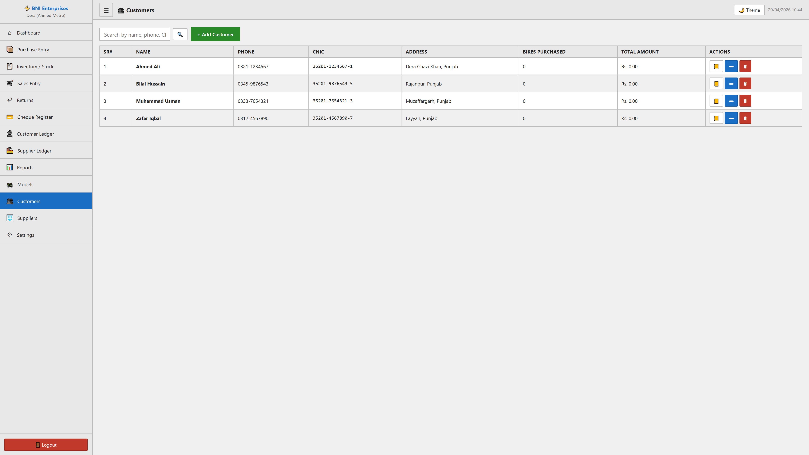

# Customers Module

## Purpose
This module facilitates the manage of customers within the system. It allows for the tracking, reporting, and classification of critical business records.

## Form Fields & Controls
- **Name**: [text] - Primary record identifier for classification.
- **Phone**: [text] - Captures standardized information for records.
- **CNIC**: [text] - Captures standardized information for records.
- **Address**: [textarea] - Captures standardized information for records.

## Data Architecture (Tables)
| SR# | NAME | PHONE | CNIC | ADDRESS | BIKES PURCHASED | TOTAL AMOUNT | ACTIONS |
| --- | --- | --- | --- | --- | --- | --- | --- |
| 1 | Ahmed Ali | 0321-1234567 | 35201-1234567-1 | Dera Ghazi Khan, Punjab | 0 | Rs. 0.00 | 📒
✏
🗑 |
| 2 | Bilal Hussain | 0345-9876543 | 35201-9876543-5 | Rajanpur, Punjab | 0 | Rs. 0.00 | 📒
✏
🗑 |
| 3 | Muhammad Usman | 0333-7654321 | 35201-7654321-3 | Muzaffargarh, Punjab | 0 | Rs. 0.00 | 📒
✏
🗑 |

## Visual Evidence

