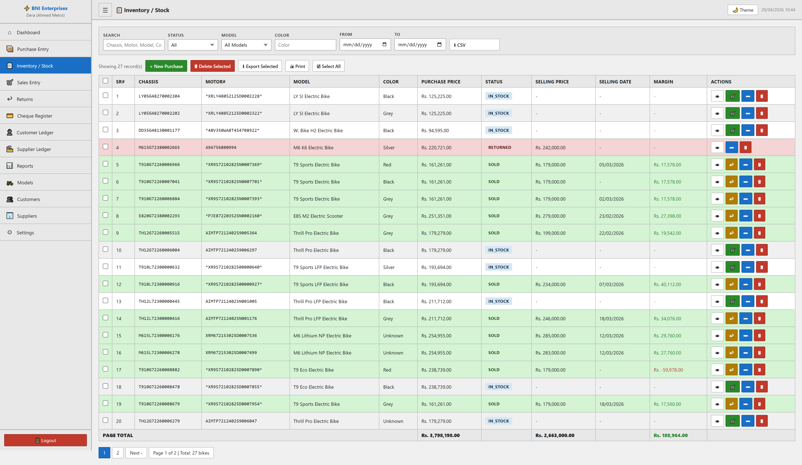

# Inventory / Stock Module

## Purpose
This module facilitates the manage of inventory / stock within the system. It allows for the tracking, reporting, and classification of critical business records.

## Form Fields & Controls
- **SEARCH**: [text] - Captures standardized information for records.
- **STATUS**: [select] - Standardized categorization dropdown.
- **MODEL**: [select] - Standardized categorization dropdown.
- **COLOR**: [text] - Captures standardized information for records.
- **FROM**: [date] - Chronological tracking for historical reporting.
- **TO**: [date] - Chronological tracking for historical reporting.

## Data Architecture (Tables)
|  | SR# | CHASSIS | MOTOR# | MODEL | COLOR | PURCHASE PRICE | STATUS | SELLING PRICE | SELLING DATE | MARGIN | ACTIONS |
| --- | --- | --- | --- | --- | --- | --- | --- | --- | --- | --- | --- |
|  | 1 | LY05G48270002304 | *XRLY48052125D0002228* | LY SI Electric Bike | Black | Rs. 125,225.00 | IN_STOCK | - | - | - | 👁
🛒
✏
🗑 |
|  | 2 | LY05G48270002202 | *XRLY48052125D0002322* | LY SI Electric Bike | Grey | Rs. 125,225.00 | IN_STOCK | - | - | - | 👁
🛒
✏
🗑 |
|  | 3 | DD35G48130001177 | *48V350WA8T454708922* | W. Bike H2 Electric Bike | Black | Rs. 94,595.00 | IN_STOCK | - | - | - | 👁
🛒
✏
🗑 |

## Visual Evidence

