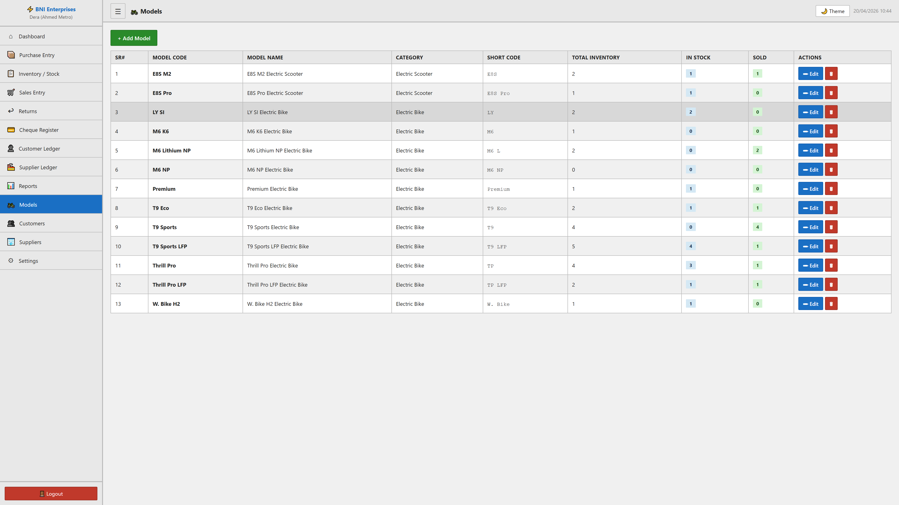

# Models Module

## Purpose
This module facilitates the manage of models within the system. It allows for the tracking, reporting, and classification of critical business records.

## Form Fields & Controls
- **Model Code**: [text] - Captures standardized information for records.
- **Model Name**: [text] - Primary record identifier for classification.
- **Category**: [text] - Captures standardized information for records.
- **Short Code**: [text] - Captures standardized information for records.

## Data Architecture (Tables)
| SR# | MODEL CODE | MODEL NAME | CATEGORY | SHORT CODE | TOTAL INVENTORY | IN STOCK | SOLD | ACTIONS |
| --- | --- | --- | --- | --- | --- | --- | --- | --- |
| 1 | E8S M2 | E8S M2 Electric Scooter | Electric Scooter | E8S | 2 | 1 | 1 | ✏ Edit
🗑 |
| 2 | E8S Pro | E8S Pro Electric Scooter | Electric Scooter | E8S Pro | 1 | 1 | 0 | ✏ Edit
🗑 |
| 3 | LY SI | LY SI Electric Bike | Electric Bike | LY | 2 | 2 | 0 | ✏ Edit
🗑 |

## Visual Evidence

