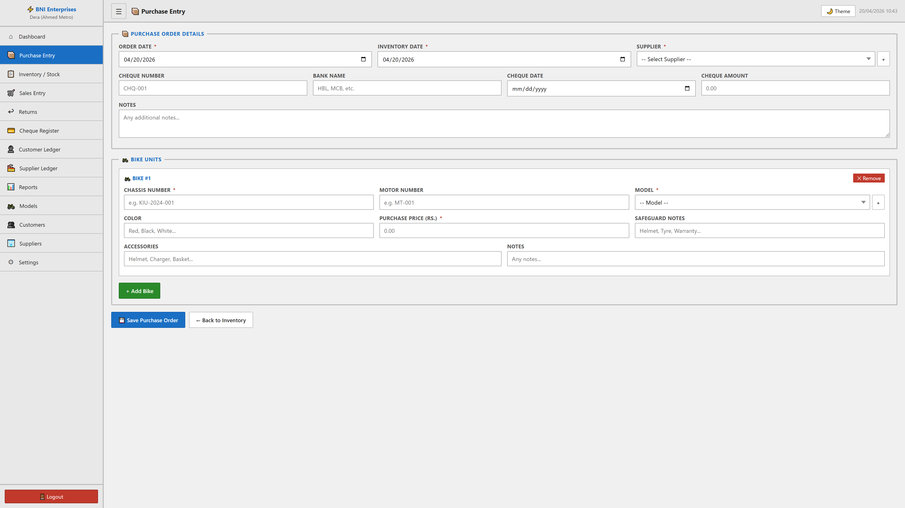
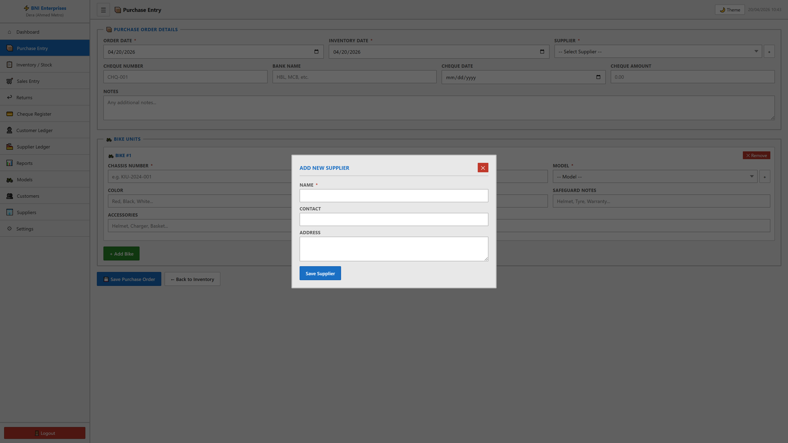

# Purchase Entry Module

## Purpose
This module facilitates the manage of purchase entry within the system. It allows for the tracking, reporting, and classification of critical business records.

## Form Fields & Controls
- **ORDER DATE**: [date] - Chronological tracking for historical reporting.
- **INVENTORY DATE**: [date] - Chronological tracking for historical reporting.
- **SUPPLIER**: [select] - Standardized categorization dropdown.
- **CHEQUE NUMBER**: [text] - Captures standardized information for records.
- **BANK NAME**: [text] - Primary record identifier for classification.
- **CHEQUE DATE**: [date] - Chronological tracking for historical reporting.
- **CHEQUE AMOUNT**: [number] - Captures standardized information for records.
- **NOTES**: [textarea] - Captures standardized information for records.
- **CHASSIS NUMBER**: [text] - Captures standardized information for records.
- **MOTOR NUMBER**: [text] - Captures standardized information for records.
- **MODEL**: [select] - Standardized categorization dropdown.
- **COLOR**: [text] - Captures standardized information for records.
- **PURCHASE PRICE (RS.)**: [number] - Captures standardized information for records.
- **SAFEGUARD NOTES**: [text] - Captures standardized information for records.
- **ACCESSORIES**: [text] - Captures standardized information for records.
- **NOTES**: [text] - Captures standardized information for records.
- **Name**: [text] - Primary record identifier for classification.
- **Contact**: [text] - Captures standardized information for records.
- **Address**: [textarea] - Captures standardized information for records.
- **Model Code**: [text] - Captures standardized information for records.
- **Model Name**: [text] - Primary record identifier for classification.
- **Category**: [text] - Captures standardized information for records.
- **Short Code**: [text] - Captures standardized information for records.

## Visual Evidence

### Interface Variation: + Modal
Captures supplementary data during complex transactions.

