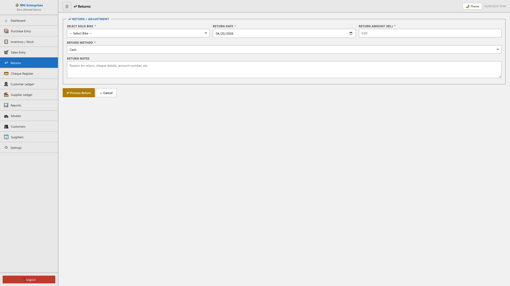

# Returns Module

## Purpose
This module facilitates the manage of returns within the system. It allows for the tracking, reporting, and classification of critical business records.

## Form Fields & Controls
- **SELECT SOLD BIKE**: [select] - Standardized categorization dropdown.
- **RETURN DATE**: [date] - Chronological tracking for historical reporting.
- **RETURN AMOUNT (RS.)**: [number] - Captures standardized information for records.
- **REFUND METHOD**: [select] - Standardized categorization dropdown.
- **Cheque Number**: [text] - Captures standardized information for records.
- **Bank Name**: [text] - Primary record identifier for classification.
- **Cheque Date**: [date] - Chronological tracking for historical reporting.
- **RETURN NOTES**: [textarea] - Captures standardized information for records.

## Visual Evidence

