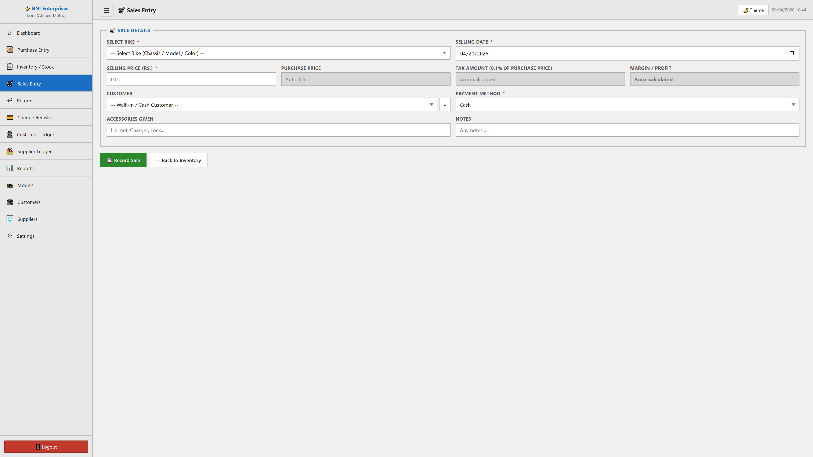
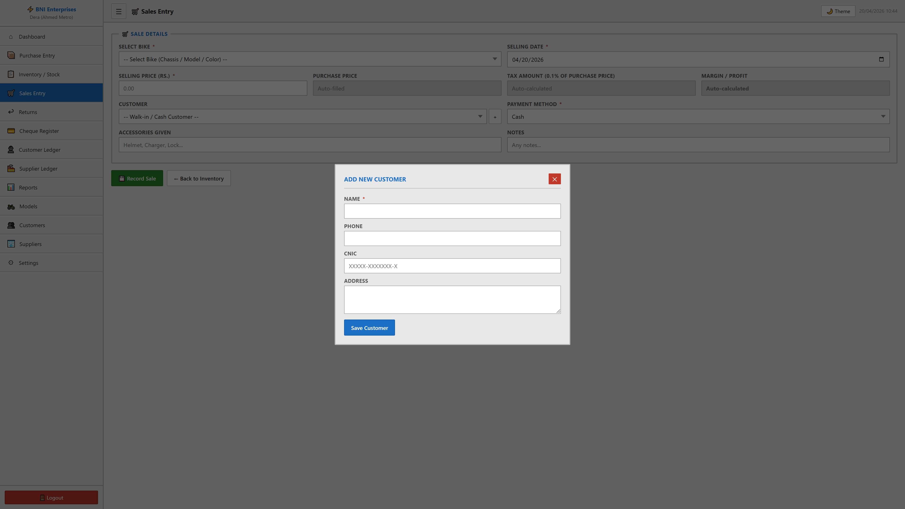

# Sales Entry Module

## Purpose
This module facilitates the manage of sales entry within the system. It allows for the tracking, reporting, and classification of critical business records.

## Form Fields & Controls
- **SELECT BIKE**: [select] - Standardized categorization dropdown.
- **SELLING DATE**: [date] - Chronological tracking for historical reporting.
- **SELLING PRICE (RS.)**: [number] - Captures standardized information for records.
- **PURCHASE PRICE**: [number] - Captures standardized information for records.
- **TAX AMOUNT (0.1% OF PURCHASE PRICE)**: [text] - Captures standardized information for records.
- **MARGIN / PROFIT**: [text] - Captures standardized information for records.
- **CUSTOMER**: [select] - Standardized categorization dropdown.
- **PAYMENT METHOD**: [select] - Standardized categorization dropdown.
- **Cheque Number**: [text] - Captures standardized information for records.
- **Bank Name**: [text] - Primary record identifier for classification.
- **Cheque Date**: [date] - Chronological tracking for historical reporting.
- **Cheque Amount**: [number] - Captures standardized information for records.
- **ACCESSORIES GIVEN**: [text] - Captures standardized information for records.
- **NOTES**: [text] - Captures standardized information for records.
- **Name**: [text] - Primary record identifier for classification.
- **Phone**: [text] - Captures standardized information for records.
- **CNIC**: [text] - Captures standardized information for records.
- **Address**: [textarea] - Captures standardized information for records.

## Visual Evidence

### Interface Variation: + Modal
Captures supplementary data during complex transactions.

