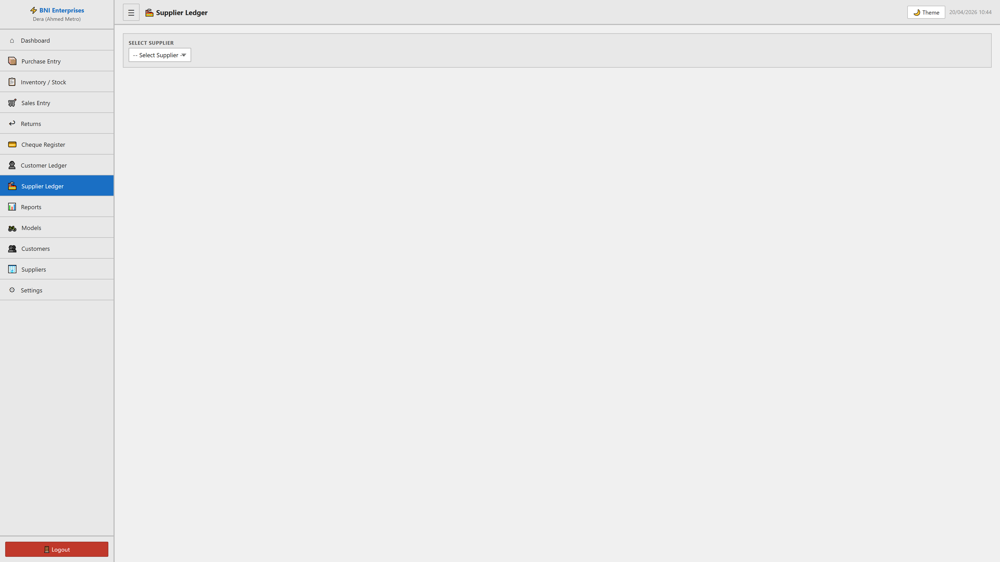

# Supplier Ledger Module

## Purpose
This module facilitates the manage of supplier ledger within the system. It allows for the tracking, reporting, and classification of critical business records.

## Form Fields & Controls
- **SELECT SUPPLIER**: [select] - Standardized categorization dropdown.

## Visual Evidence

