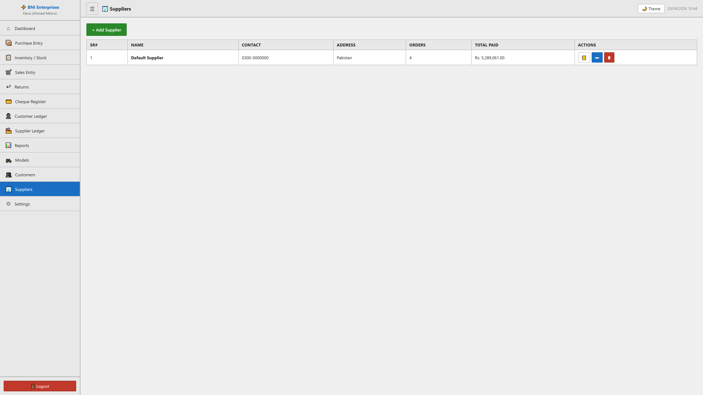

# Suppliers Module

## Purpose
This module facilitates the manage of suppliers within the system. It allows for the tracking, reporting, and classification of critical business records.

## Form Fields & Controls
- **Name**: [text] - Primary record identifier for classification.
- **Contact**: [text] - Captures standardized information for records.
- **Address**: [textarea] - Captures standardized information for records.

## Data Architecture (Tables)
| SR# | NAME | CONTACT | ADDRESS | ORDERS | TOTAL PAID | ACTIONS |
| --- | --- | --- | --- | --- | --- | --- |
| 1 | Default Supplier | 0300-0000000 | Pakistan | 4 | Rs. 5,289,061.00 | 📒
✏
🗑 |

## Visual Evidence

