# 🏍️ BNI Enterprises - Bike Dealer Management System (BDMS)
## The Definitive Master Documentation (v2.0.0)

This is the exhaustive, complete, and definitive master documentation for the **BNI Enterprises Bike Dealer Management System (BDMS)**. This document contains every single detail, module specification, database schema, business logic formula, and visual evidence associated with the application. Nothing has been omitted.

---

## 📑 Table of Contents
1. [Project Overview](#1-project-overview)
2. [Technical Architecture & System Requirements](#2-technical-architecture--system-requirements)
3. [Complete Database Schema (All 25 Tables)](#3-complete-database-schema)
4. [Role-Based Access Control (RBAC) & Security](#4-role-based-access-control-rbac--security)
5. [Exhaustive Module Breakdown](#5-exhaustive-module-breakdown)
    - [Intelligent Dashboard](#a-intelligent-dashboard)
    - [Inventory / Stock Control](#b-inventory--stock-control)
    - [Purchase Entry & Procurement](#c-purchase-entry--procurement)
    - [Sales Entry, Invoicing & Quotations](#d-sales-entry-invoicing--quotations)
    - [Installment & Financing System](#e-installment--financing-system)
    - [Returns Management](#f-returns-management)
    - [Financial Ecosystem: Cheques & Ledgers](#g-financial-ecosystem-cheques--ledgers)
    - [Customers & Suppliers (CRM)](#h-customers--suppliers-crm)
    - [Income / Expense Tracker](#i-income--expense-tracker)
    - [Accessories Management](#j-accessories-management)
    - [Quotations Module](#k-quotations-module)
    - [Users & Roles (RBAC)](#l-users--roles-rbac)
    - [Bank Deposits](#m-bank-deposits)
    - [System Settings & Calibration](#n-system-settings--calibration)
    - [Money Destination Tracking & Money Flow](#o-money-destination-tracking--money-flow)
    - [Landing Page (Public Website)](#p-landing-page-public-website)
6. [Business Logic, Math & Tax Formulas](#6-business-logic-math--tax-formulas)
7. [Bilingual User Manual (Urdu / اردو)](#7-bilingual-user-manual-urdu--اردو)

---

## 1. Project Overview
**BNI Enterprises BDMS** is an enterprise-grade inventory and financial management solution engineered from the ground up by **Yasin Ullah**. Designed specifically for high-volume motorcycle dealerships, it eliminates manual ledgers by digitizing the entire business lifecycle: procurement, inventory tracking (chassis/motor level), dynamic sales margins, tax calculations, installment scheduling, accessories management, quotations, income/expense tracking, double-entry accounting via ledgers and cheque registers, money destination tracking, bank deposit management, role-based access control, and a public-facing landing page with leadership/gallery management.

---

## 2. Technical Architecture & System Requirements
- **Backend:** PHP (7.4 or 8.x compatibility).
- **Database:** MySQL 5.7+ or MariaDB.
- **Frontend Stack:** HTML5, CSS3 (Vanilla + Custom CSS Variables), JavaScript (ES6), jQuery, Select2 (Dropdowns), DataTables (Grids), SweetAlert2 (Notifications).
- **Security Protocols:**
  - Password Hashing: `PASSWORD_DEFAULT` (Bcrypt).
  - CSRF Protection: Unique tokens per session validated on every POST request.
  - Brute Force Protection: IP banning after 7 failed attempts within 3 hours.
  - Session Hardening: Configurable idle timeouts (default 40 mins) and absolute timeouts (default 8 hours).
  - Captcha: Custom-generated SVG mathematical captcha for login.

---

## 3. Complete Database Schema
The system operates on 23+ highly normalized, relational tables.

1. `settings`: Stores global configurations (Company name, tax rates, themes, timeouts, landing page content).
2. `suppliers`: Supplier directory (`name`, `contact`, `address`).
3. `customers`: Customer CRM (`name`, `phone`, `cnic`, `is_filer`, `address`).
4. `models`: Master list of bike variants (`model_code`, `model_name`, `category`, `short_code`, `image`, `top_speed`, `max_range`).
5. `accessories`: Helmets, chargers, etc. (`sku` UNIQUE, `purchase_price`, `selling_price`, `current_stock`).
6. `purchase_orders`: Header records for procurement (`order_date`, `supplier_id`, `total_units`, `total_amount`, `notes`).
7. `bikes`: **The core table.** Tracks every unit (`chassis_number` UNIQUE, `motor_number`, `purchase_price`, `selling_price`, `status` ENUM: `in_stock`/`sold`/`returned`/`returned_to_supplier`/`reserved`/`damaged_lost`, `margin`, `tax_amount`).
8. `sale_accessories`: Accessories sold with a bike (`bike_id`, `accessory_id`, `quantity`, `unit_price`, `discount_amount`, `final_price`).
9. `payments`: Global transaction log for all cash, bank transfer, and cheque movements.
10. `installments`: Monthly payment plans (`bike_id`, `customer_id`, `due_date`, `installment_amount`, `amount_paid`, `penalty_fee`, `status`: pending/paid/overdue/cancelled).
11. `ledger`: Double-entry accounting system mapping debits and credits to customers and suppliers (`entry_type`, `party_type`, `party_id`, `reference_type`, `reference_id`, `balance`).
12. `roles`: Access levels (e.g., Administrator, Manager).
13. `role_permissions`: Granular page-level permissions (View, Add, Edit, Delete) for 20+ pages.
14. `users`: System operators linked to roles (with `is_active` toggle).
15. `income_expenses`: Operational accounting for daily showroom expenses or external income.
16. `quotations`: Pre-sales documents with validity dates, accessories, converting to live sales.
17. `money_destinations`: Master list of money destinations (type: bank/person/wallet, name, details, account_title, account_no, branch, opening_balance, contact_person, contact_phone, is_active).
18. `sale_money_allocations`: Per-sale money tracking linking bikes to destinations with amounts, dates, and audit info.
19. `bank_deposits`: Actual bank deposit records with receipt images (`destination_id`, `deposit_type`: cash/cheque/transfer/online, `receipt_image`).
20. `deposit_allocations`: Links deposits to specific sale allocations (`deposit_id`, `allocation_id`, `bike_id`, `amount`).
21. `cheque_register`: Consolidated cheque tracking (`cheque_number`, `bank_name`, `status`: pending/cleared/bounced/cancelled, `type`: payment/receipt/refund).
22. `leadership`: Public landing page team members (name, position, image, message, sort_order).
23. `gallery`: Public landing page gallery items (title, description, image, sort_order).
24. `bike_requests`: Public bike inquiry submissions (customer_name, phone, bike_details, status).
25. `quote_requests`: Public quote request submissions (customer_name, phone, details, status).

---

## 4. Role-Based Access Control (RBAC) & Security
The system uses a strict RBAC engine. 
- **Administrator:** Unrestricted access to all modules, settings, and destructive actions.
- **Manager (Default):** Limited to basic operations like viewing the dashboard and inventory, without access to global settings or role deletion.
- Permissions are evaluated at the page and action level (`can_view`, `can_add`, `can_edit`, `can_delete`).

---

## 5. Exhaustive Module Breakdown

### A. Intelligent Dashboard
**Purpose:** The nerve center providing real-time tracking, reporting, and classification of critical business records.
- **Data Points Shown:** 
  - Model-wise availability (e.g., E8S M2 Electric Scooter: 2 Inventory, 1 Sold, 1 Available).
  - Recent Sales grid showing Date, Chassis, Model, Price, and Exact Margin.
  - Recent Stock additions showing Date, Chassis, Price, and Status.
- **Visual Evidence:**
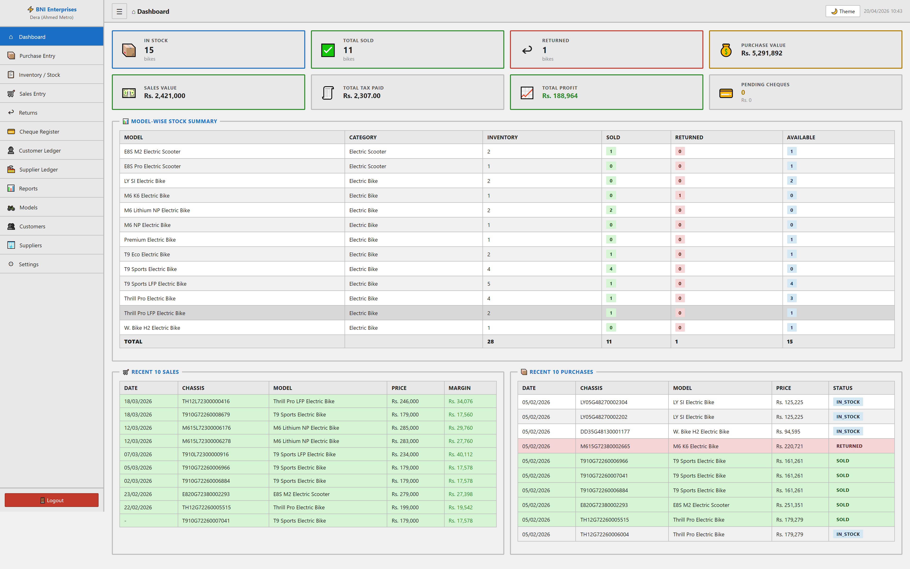

### B. Inventory / Stock Control
**Purpose:** Granular tracking of every physical asset.
- **Statuses:** In Stock, Sold, Returned, Returned to Supplier, Reserved, Damaged/Lost.
- **Filters & Controls:** Text Search, Status (all 6), Model Dropdown, Color, Date Range (From/To).
- **Grid Columns:** Sr#, Image, Chassis, Motor#, Model, Color, Purchase Price, Status, Selling Price, Selling Date, Margin, Actions (View, Sell, Return, Edit, Delete).
- **Features:** Bulk Deletion (safety checks), Bulk CSV Export, Full CSV Export, Edit modal (color, price, status, notes, image), Page totals (purchase price, selling price, margin).
- **Bike Detail View:** Complete lifecycle timeline (Purchased → Inventory → Sold → Returned) with full specs.
- **Visual Evidence:**
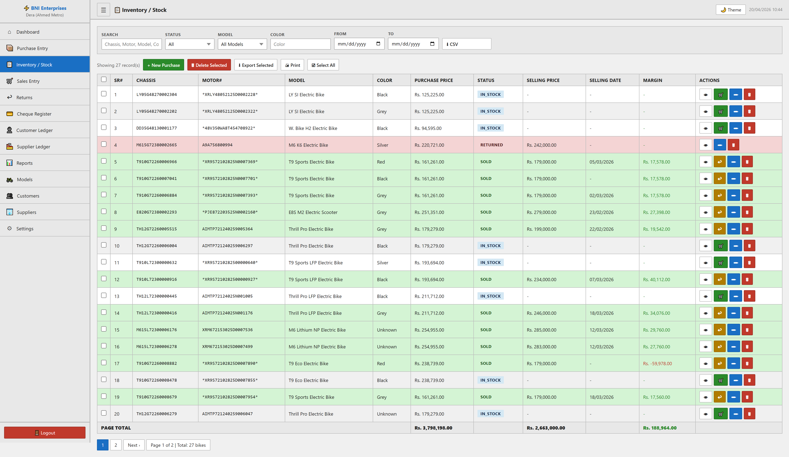

### C. Purchase Entry & Procurement
**Purpose:** Workflow for ingesting new stock from suppliers.
- **Fields:** Order Date, Inventory Date, Supplier, Notes.
- **Dynamic Payment Rows:** Cash, Cheque, Bank Transfer, Online — multiple payments per purchase, cheque fields dynamic.
- **Bike Data Entry:** Chassis Number (AJAX uniqueness check), Motor Number, Model, Color, Purchase Price, Safeguard Notes, Image upload (auto-resize 800px).
- **Auto-Divide Payment:** Toggle to auto-split total payment across all bike rows.
- **Modal Additions:** Built-in modals to add new Suppliers or Models without leaving the purchase screen.
- **Tax Calculation:** Per-bike tax auto-calculated based on configurable base (purchase or selling price).
- **Visual Evidence:**
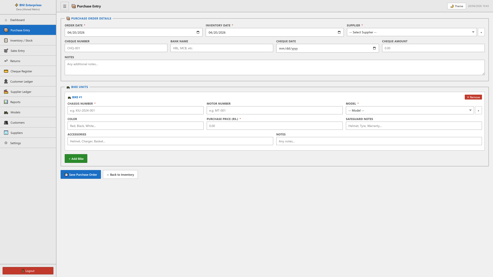
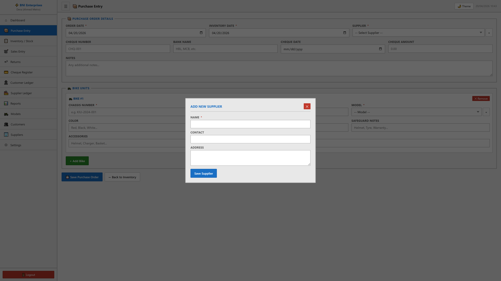

### D. Sales Entry, Invoicing & Quotations
**Purpose:** Revenue generation and client fulfillment.
- **Sales Fields:** Select Bike (auto-fills purchase price), Selling Date, Selling Price, Tax Amount (Auto-calculated), Margin/Profit (Auto-calculated: Selling − Purchase − Tax).
- **Customer Details:** Select existing (shows filer status) or add via modal. Walk-in/Cash Customer option (full payment enforced).
- **Customer Advance Display:** Shows available advance/balance when customer is selected.
- **Payment & Installments:** Down Payment + Payment Method (Cash/Cheque/Bank Transfer/Online), Total Installments, Installment Amount (auto-calculated), First Due Date.
- **Accessories:** Dynamic rows with accessory selection, quantity, unit price, discount, final price. Auto stock deduction.
- **Money Allocation:** Optional collapsible section to allocate sale proceeds to money destinations inline during sale.
- **Quotations:** Create quotes with accessories that can be converted to 1-click sales (preserves all data).
- **Visual Evidence:**
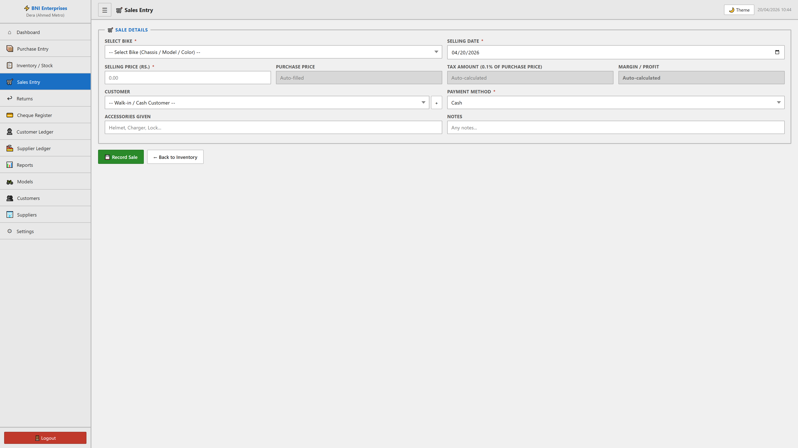
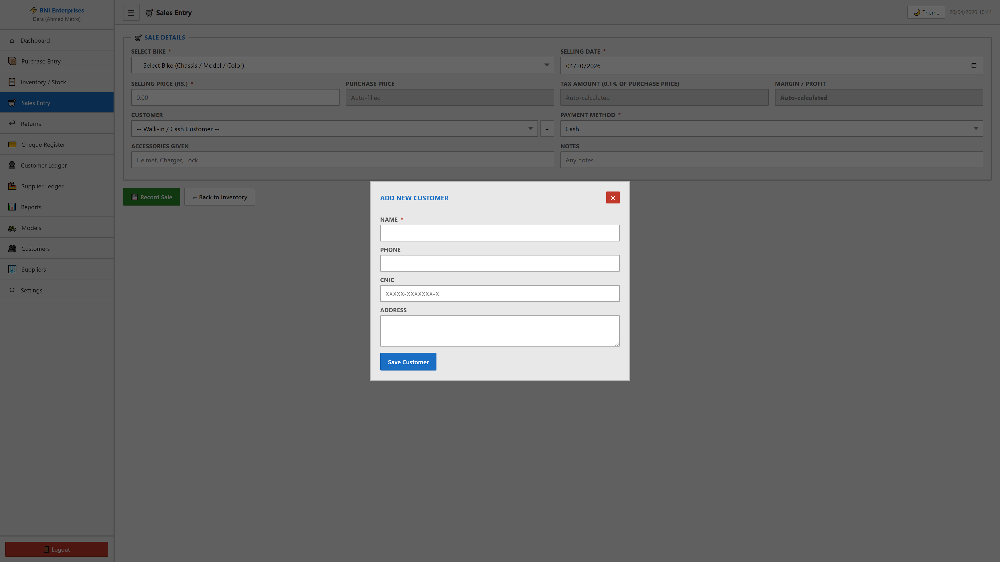

### E. Installment & Financing System
**Purpose:** Management of monthly payment plans.
- **Functionality:** When a sale is made with a down payment less than the total, the system generates monthly installment rows.
- **Tracking:** Monitors `Amount Paid` vs `Installment Amount`. Automatically handles `Penalty Fees` for late payments. Links directly to the ledger upon payment collection.
- **Overdue Detection:** Automatic highlighting of past-due installments with color-coded status badges.
- **Auto-Distribution:** Payments auto-allocate to oldest pending installments first.
- **Payment Modal:** Enter amount paid, penalty fee, payment date, payment method; cheque details supported.
- **Cancellation:** Installments auto-cancelled on sale return.

### F. Returns Management
**Purpose:** Handling canceled sales and asset recovery.
- **Dual Sub-tabs:** Sales Returns (customer → dealer) and Purchase Returns (dealer → supplier).
- **Sales Return Fields:** Select Sold Bike, Return Date, Return Amount (Refund), Refund Method (Cash/Cheque/Bank/Online), Return Notes.
- **Logic:** Reverts bike status from `sold` to `returned`, records payment (customer_refund), creates reversal ledger entries, cancels pending installments, restores accessory stock, clears money allocations.
- **Purchase Return Fields:** Select In-Stock Bike, Return Date, Refund Received Amount (auto-fills purchase price), Refund Method, Notes.
- **Logic:** Updates status to `returned_to_supplier`, records payment (supplier_refund), creates reversal ledger entries.
- **Visual Evidence:**
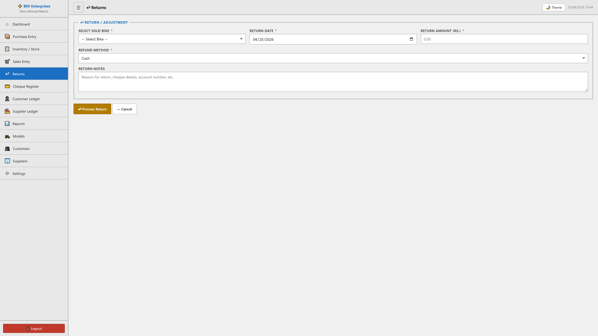

### G. Financial Ecosystem: Cheques & Ledgers
**Purpose:** Complete financial transparency.
- **Cheque Register:** Tracks all cheques (Payments & Receipts). Fields include Bank, Date, Amount, Type, Status (Pending, Cleared, Bounced, Cancelled), Party, and Reference.
- **Cheque Bounce Handling:** Auto-reverses ledger entries, adjusts installments, adds penalty fees.
- **Ledgers:** Automated double-entry system. Every sale debits the customer ledger; every payment credits it. Same for suppliers. Shows running balances with Due/Advance color indicators.
- **Printable Ledgers:** Both customer and supplier ledgers are print-optimized.
- **Visual Evidence:**
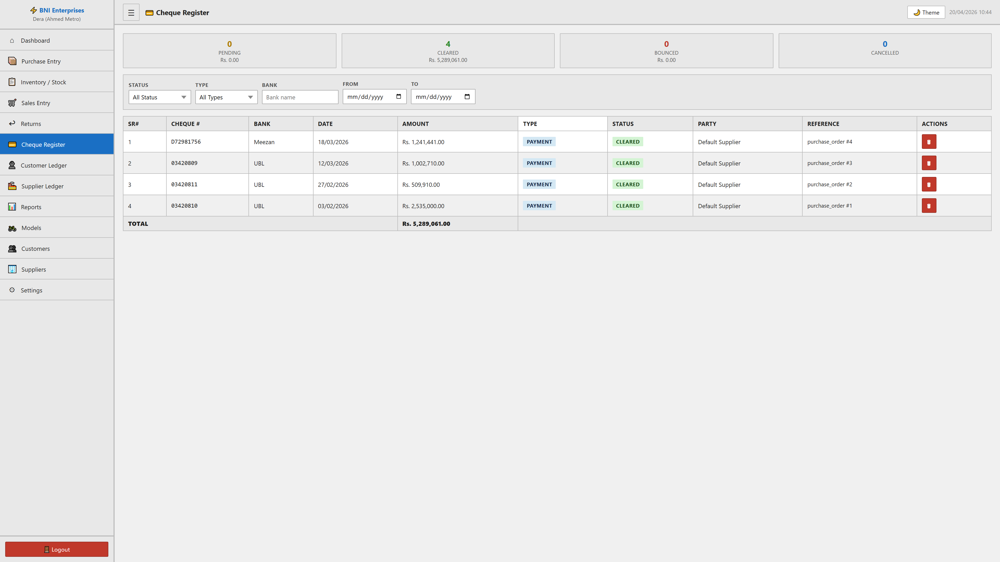
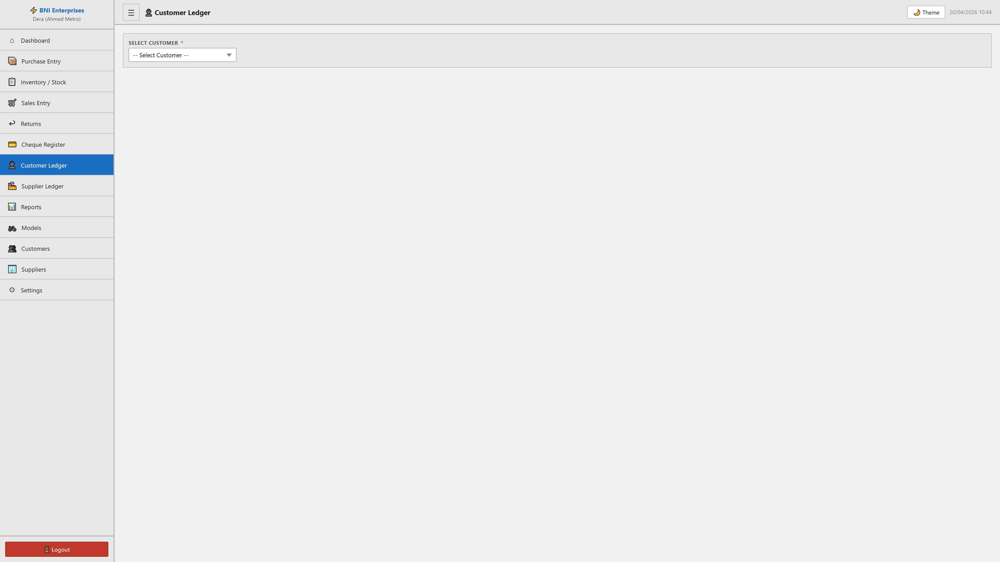
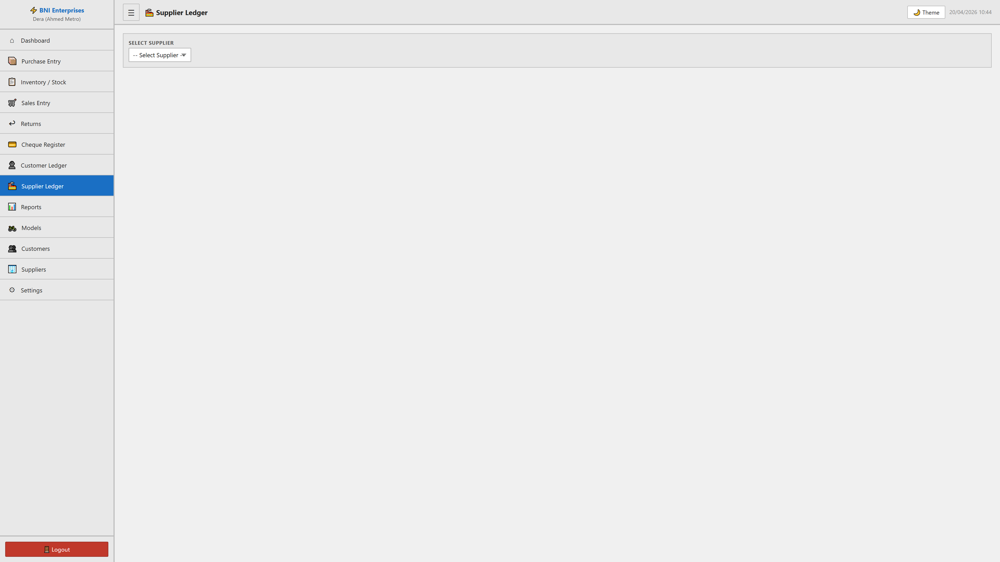

### H. Customers & Suppliers (CRM)
**Purpose:** Directory and relationship management.
- **Customer Grid:** Name, Phone, CNIC, Is Filer (badge), Address, Total Bikes Purchased, Total Amount Spent. Direct link to customer ledger.
- **Supplier Grid:** Name, Contact, Address, Total Orders, Total Paid. Direct link to supplier ledger.
- **Name Change Propagation:** Customer/supplier name changes auto-update historical payment records.
- **Visual Evidence:**
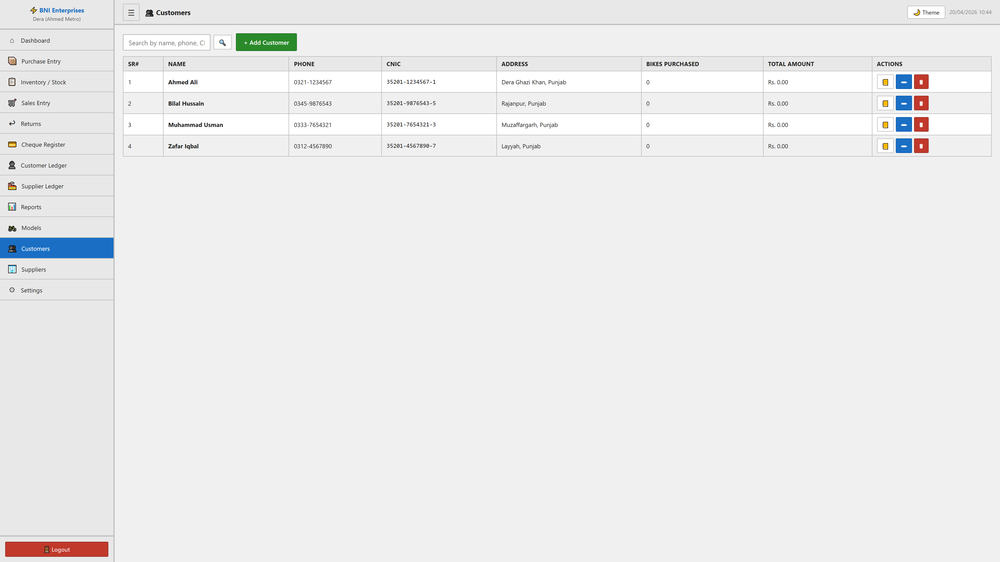
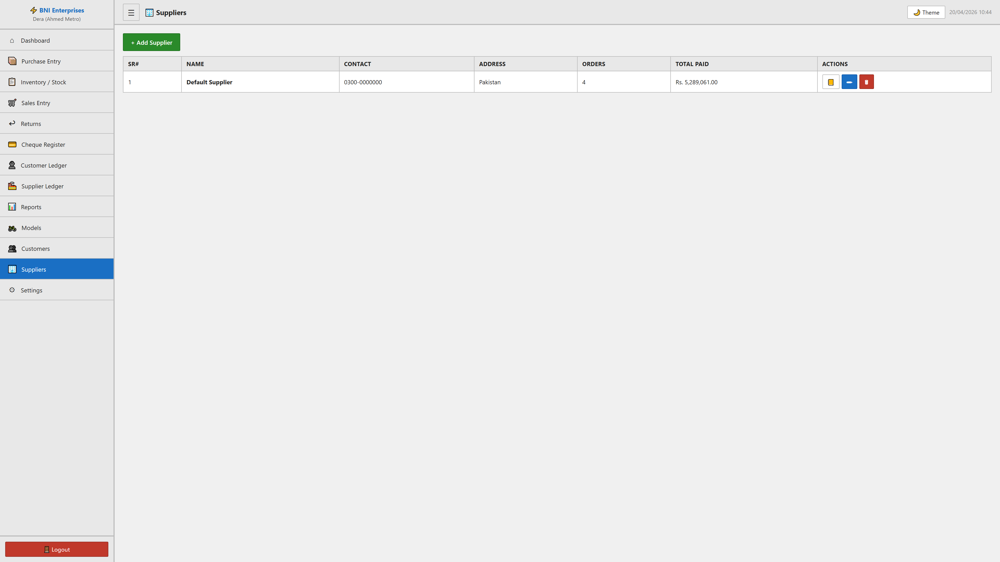

### I. Income / Expense Tracker
**Purpose:** Non-bike financial tracking and operational accounting.
- **Entry Fields:** Date, Type (Income/Expense), Category (autocomplete from existing), Amount, Payment Method, Reference, Notes.
- **Summary Cards:** Total income, total expense, net balance, avg transaction, top income/expense categories.
- **Charts:** Income by category (doughnut), expense by category (doughnut), daily trend (line) with Chart.js.
- **Auto-Expense Generation:** Marking bike as Damaged/Lost auto-creates "Inventory Loss" entry.
- **Created-By Tracking:** User attribution for accountability.

### J. Accessories Management
**Purpose:** Full accessory inventory control.
- **CRUD:** Name, SKU (unique), purchase price, selling price, current stock.
- **Analytics Dashboard:** Total items, total stock, stock value (PP/SP), sold quantity, revenue, profit, discounts, estimated future profit.
- **Charts:** Top 5 sold accessories (bar chart), Stock & Sales overview.
- **Auto Stock Deduction:** Stock decreases on sale; auto-restores on sale return.
- **Custom Accessory:** Add custom items during sale if not in inventory.

### K. Quotations Module
**Purpose:** Pre-sales quoting with seamless conversion.
- **Creation:** Quote date, valid until, customer (details auto-displayed), bike (model/color/category), quoted price, accessories (dynamic rows), notes.
- **One-Click Conversion:** Convert pending quotation to sale — auto-creates sale entry, payment, ledger entries, installments. Status → `converted`.
- **Status Tracking:** Pending, Accepted, Rejected, Converted.
- **Edit/Delete:** Full CRUD with permission checks.

### L. Users & Roles (RBAC)
**Purpose:** Multi-user access control.

**Roles:** Create custom roles with granular page-level permissions (view/add/edit/delete for 20+ pages). Administrator role protected.

**Users:** Full CRUD with username, full name, role, strong password enforcement (8+ chars, uppercase, lowercase, digit, special), active/inactive toggle. Cannot delete self or admin.

### M. Bank Deposits
**Purpose:** Record actual bank deposits and link to sale allocations.
- **Deposit Fields:** Destination (bank), date, amount, deposit type (cash/cheque/transfer/online), reference, receipt image upload (auto-compressed), deposited by, notes.
- **Link to Sales:** Select which bike sale allocations are covered by this deposit.
- **Deposit Status:** See deposit progress per allocation (Deposited/Partial/Pending).
- **Dashboard Widget:** Pending bank deposit total.
- **Report:** Date-range filtering, breakdown by deposit type, per-deposit sale linkage.

### N. System Settings & Calibration
**Purpose:** Application behavior configuration.
- **Configurable Options:** Company Name, Branch Name, Currency Symbol, Tax Rate, Tax On (Purchase/Selling Price), Show Purchase Price on Invoice, Session Timeouts (Idle/Absolute).
- **Maintenance:** 1-Click Database Backup (all 23+ tables), Database Restore with overwrite warning.
- **Theme Toggle:** Dark/Light with localStorage persistence.
- **Password Change:** Strong enforcement with bcrypt hashing.
- **App Logo Upload:** Auto-generates all icon sizes (favicon, apple-touch, PWA manifest).
- **Landing Page Manager:** Hero, leadership, gallery, bike/quote requests, social media, company info.
- **System Info:** Version, author, PHP/MySQL versions, database name, server time.
- **Visual Evidence:**
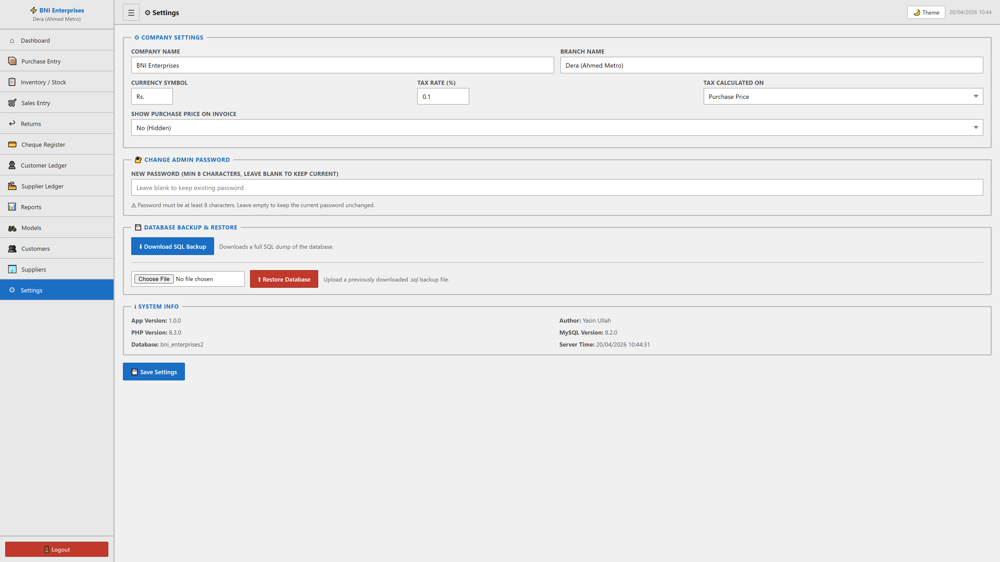

### O. Money Destination Tracking & Money Flow
**Purpose:** Track where sale money ends up — banks, persons, or wallets — with full CRUD and comprehensive reporting.

**Money Destinations (CRUDable):**
- Manage banks (account title, number, branch, opening balance, contact person/phone), persons, and wallets.
- Active/inactive toggle. 9 default destinations pre-seeded.

**Money Tracking:**
- Allocate sale proceeds to one or more destinations per sale.
- Full CRUD on allocations at any time after sale.
- Inline allocation during sale entry (collapsible section).
- Audit trail: created_by tracking.

**Reports (4 Sub-tabs):**
  - Money by Destination: Per-destination totals with date filtering.
  - Money by Sale: Per-sale breakdown with destination allocation chips.
  - Untracked Sales: Sales with no/partial allocation (direct "Track" link).
  - Money Flow: Monthly flow per destination type.

### P. Landing Page (Public Website)
**Purpose:** Public-facing company showcase.
- **landing.php:** Full company website with Three.js 3D particle background.
- **Sections:** Hero, About, Vision/Mission, Leadership Team, Gallery, Bike Request Form, Quote Request Form, Contact with Google Maps, WhatsApp integration.
- **Admin Controls:** All content managed via `?page=landing_page`.
- **SEO:** Dynamic meta tags, OpenGraph support, optimized performance.

---

## 6. Business Logic, Math & Tax Formulas
**Purpose:** Track where sale money ends up — banks, persons, or wallets — with full CRUD and comprehensive reporting.
- **Money Destinations (CRUDable):** Manage a master list of banks, persons, and wallets with name, details, and active status. 9 default destinations pre-seeded.
- **Money Tracking:** Allocate sale proceeds to one or more destinations per sale. Supports adding/editing/deleting allocations at any time after the sale.
- **Sale Form Integration:** Optional collapsible section during sale entry to track money destinations inline.
- **Reports (4 Sub-tabs):**
  - Money by Destination: Per-destination totals with date filtering.
  - Money by Sale: Per-sale breakdown showing destination allocation chips.
  - Untracked Sales: Sales with missing or partial money allocation (with direct “Track” link).
  - Money Flow: Monthly summary of money flow per destination type.

---

## 6. Business Logic, Math & Tax Formulas

The BDMS is built on strict financial rules to ensure accounting accuracy:

**1. Base Profit Calculation:**
`Margin = Selling Price - Purchase Price - Tax Amount`

**2. Tax Logic (Dynamic based on settings):**
- *If Tax on Purchase:* `Tax Amount = Purchase Price * (Tax Rate / 100)`
- *If Tax on Selling:* `Tax Amount = Selling Price * (Tax Rate / 100)`

**3. Total Sale Value (With Accessories):**
`Total Sale Amount = Selling Price + Sum(Accessories Final Price)`

**4. Installment Calculation:**
`Remaining Balance = Total Sale Amount - Down Payment`
`Monthly Installment = Remaining Balance / Total Installments`

**5. Ledger Double Entry (Example: Sale):**
- System creates a `Debit` entry for the Customer for the `Total Sale Amount`.
- If a Down Payment is made, system creates a `Credit` entry for the Customer for the `Down Payment Amount`.
- Running balance is strictly maintained.

---

## 7. Bilingual User Manual (Urdu / اردو)

**بی این آئی انٹرپرائزز (BNI Enterprises) - موٹر سائیکل شو روم مینجمنٹ سسٹم**
**مکمل اور جامع گائیڈ (صرف کلائنٹ کے لیے)**

یہ دستاویز آپ کی نئی کمپیوٹر ایپ کو استعمال کرنے اور سمجھنے کے لیے بنائی گئی ہے۔ اس ایپ کا مقصد آپ کے شو روم کے تمام حساب کتاب کو خودکار اور آسان بنانا ہے تاکہ آپ کو رجسٹروں اور پنسل کے حساب سے نجات مل سکے۔

### 1. آپ کی تجاویز اور ہمارا کام (ہم نے کیا بنایا؟)
*   **0.1% ٹیکس کا حساب:** ایپ اب ہر بائیک کی قیمت پر 0.1% (یا آپ کی مرضی کا) ٹیکس خود نکال لیتی ہے۔
*   **منافع (Margin) کی رپورٹ:** ایپ اب "فروخت کی قیمت" سے "خریداری" اور "ٹیکس" نکال کر آپ کا اصل نفع خود دکھاتی ہے۔
*   **چیسس اور موٹر نمبر ٹریکنگ:** ہر بائیک اپنے چیسس اور موٹر نمبر سے پہچانی جاتی ہے، جس سے چوری یا غلطی کا خطرہ ختم ہو جاتا ہے۔
*   **چیک اور بینک ٹریکنگ:** ایپ میں ایک مکمل "Cheque Register" ہے جہاں آپ یو بی ایل اور میزان بینک کے چیکوں کا ریکارڈ رکھ سکتے ہیں۔
*   **واپسی کا نظام (Returns):** اگر کوئی بائیک واپس آئے تو اس کا اندراج الگ سے ہوتا ہے اور وہ خود بخود اسٹاک میں واپس آ جاتی ہے۔

### 2. ایپ کو کیسے استعمال کریں؟ (قدم بہ قدم گائیڈ)
**پہلا قدم: نئی بائیک شامل کریں (Purchase)**
*   "Purchase Entry" والے خانے میں جائیں۔
*   بائیک کا چیسس نمبر، موٹر نمبر اور ماڈل لکھیں۔ خریداری کی قیمت درج کریں اور محفوظ کریں۔

**دوسرا قدم: بائیک فروخت کریں (Sale)**
*   "Sales Entry" میں جائیں، فہرست سے بائیک منتخب کریں۔
*   گاہک کا نام، فون نمبر اور فروخت کی قیمت لکھیں۔ اگر قسطیں ہیں تو ڈاؤن پیمنٹ اور قسطوں کی تعداد درج کریں۔

**تیسرا قدم: رسید پرنٹ کریں**
*   بیچنے کے بعد "Print Invoice" کا بٹن دبائیں۔ کمپیوٹر سے گاہک کے لیے ایک خوبصورت رسید نکل آئے گی۔

**چوتھا قدم: کھاتے چیک کریں (Ledger)**
*   کس نے کتنے پیسے دیے اور کتنے باقی ہیں، یہ سب "Customer Ledger" میں دیکھا جا سکتا ہے۔

### 5. عام سوالات اور جوابات (QA)
**سوال: اگر بائیک واپس آ جائے تو کیا ہوگا؟**
**جواب:** آپ "Returns" والے بٹن پر جائیں گے۔ ایپ خود بخود اسے اسٹاک میں واپس ڈال دے گی اور گاہک کا حساب برابر کر دے گی۔

**سوال: کیا میرا ڈیٹا محفوظ ہے؟**
**جواب:** جی ہاں، "Settings" میں "Backup" کا آپشن دیا گیا ہے۔ آپ اپنا سارا ریکارڈ ایک کلک سے محفوظ کر سکتے ہیں۔

---
*End of Master Documentation. Generated dynamically for BNI Enterprises BDMS v2.0.0.*
