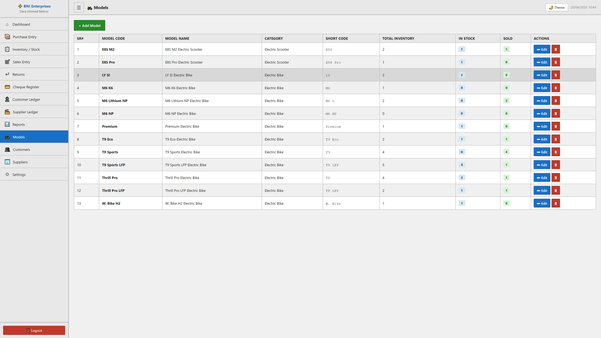
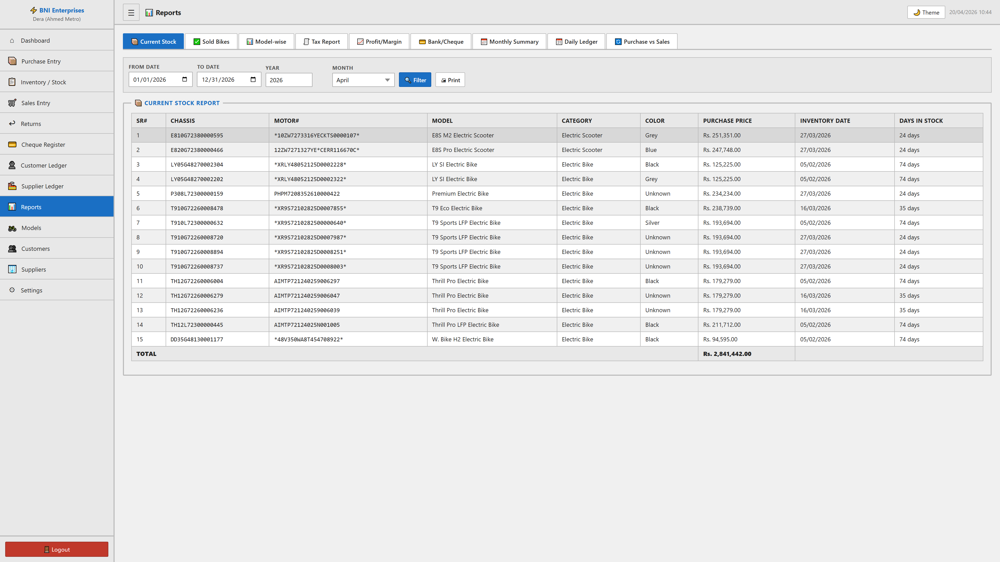

# UNIVERSAL APP GUIDELINE: POS Pro

This Master Documentation provides a comprehensive overview of every module within the POS Pro application. It details the Business Case ("Why") and Functional Workflow ("How") in both Technical English and Professional Human-Like Urdu.

---

## 1. Dashboard

**Technical English:**
The Dashboard module serves as the central command center of the POS Pro application. It is designed to provide immediate, high-level visibility into the business's financial and operational health. The business case for this module is to empower decision-makers with real-time analytics, reducing the time spent compiling reports manually. Functionally, the workflow involves aggregating data from sales, expenses, and inventory into dynamic, interactive charts. Key metrics displayed include total sales, profit margins, pending amounts, and stock alerts. Users can review 'Today's Sales', 'Monthly Revenue', and analyze 'Top Selling Products' at a glance.

**Human-Like Urdu:**
ڈیش بورڈ ماڈیول پی او ایس پرو ایپلیکیشن کے مرکزی کنٹرول روم کے طور پر کام کرتا ہے۔ اسے اس طرح ڈیزائن کیا گیا ہے کہ کاروبار کی مالی اور آپریشنل صورتحال کا فوری اور جامع جائزہ فراہم کیا جا سکے۔ اس ماڈیول کا بنیادی مقصد فیصلہ سازوں کو بروقت اور درست تجزیات فراہم کرنا ہے تاکہ رپورٹس کی تیاری میں لگنے والے وقت کی بچت ہو سکے۔ کام کے لحاظ سے، یہ فروخت، اخراجات، اور انوینٹری کے ڈیٹا کو متحرک چارٹس میں یکجا کرتا ہے۔ اہم میٹرکس میں کل فروخت، نفع و نقصان، بقایا جات، اور اسٹاک الرٹس شامل ہیں۔ صارفین ایک نظر میں 'آج کی فروخت'، 'ماہانہ آمدنی'، اور 'سب سے زیادہ فروخت ہونے والی مصنوعات' کا جائزہ لے سکتے ہیں۔

**Visual Documentation:**

---

## 2. Point of Sale (POS)

**Technical English:**
The Point of Sale module is the heartbeat of daily retail operations. It is engineered for maximum efficiency, streamlining the checkout process so cashiers can quickly scan items, apply discounts, and process transactions. The business logic allows seamless handling of multiple payment methods, calculating taxes automatically, and seamlessly applying loyalty points or store credit. The intuitive interface ensures minimal training time while maximizing customer throughput, resulting in a faster, frictionless shopping experience.

**Human-Like Urdu:**
پوائنٹ آف سیل ماڈیول روزمرہ کے ریٹیل کاموں کی دھڑکن ہے۔ اسے انتہائی کارکردگی کے لیے تیار کیا گیا ہے، جس سے چیک آؤٹ کا عمل تیز ہو جاتا ہے تاکہ کیشیئرز تیزی سے اشیاء اسکین کر سکیں، ڈسکاؤنٹ لاگو کر سکیں، اور لین دین مکمل کر سکیں۔ کاروباری منطق مختلف ادائیگی کے طریقوں کو سنبھالنے، خودکار طور پر ٹیکس کا حساب لگانے، اور لائلٹی پوائنٹس کے استعمال کی اجازت دیتی ہے۔ اس کا آسان اور مؤثر انٹرفیس تربیت کے وقت کو کم کرتا ہے اور صارفین کو تیزی سے خریداری کا ایک بہترین تجربہ فراہم کرتا ہے۔

**Visual Documentation:**

---

## 3. Products

**Technical English:**
The Products module provides a robust framework for managing your entire inventory catalog. It ensures data integrity by allowing you to define crucial parameters such as barcodes, SKUs, complex pricing tiers, stock levels, and low-stock thresholds. By categorizing items and linking them to specific brands, units, and suppliers, this module guarantees operational transparency and strict oversight over your product supply chain. Features include bulk imports, precise stock tracking, and variant definition.

**Human-Like Urdu:**
پروڈکٹس ماڈیول آپ کی تمام انوینٹری کیٹلاگ کو منظم کرنے کے لیے ایک مضبوط فریم ورک فراہم کرتا ہے۔ یہ آپ کو اہم پیرامیٹرز جیسے بارکوڈز، ایس کے یو (SKU)، قیمتوں کی سطح، اسٹاک لیول، اور کم اسٹاک کے انتباہات مقرر کرنے کی اجازت دے کر ڈیٹا کی درستگی کو یقینی بناتا ہے۔ اشیاء کی درجہ بندی کرنے اور انہیں مخصوص برانڈز، اکائیوں، اور سپلائرز سے منسلک کرنے سے، یہ ماڈیول آپ کی پروڈکٹ سپلائی چین پر مکمل نگرانی اور شفافیت کی ضمانت دیتا ہے۔ خصوصیات میں بلک درآمد (Bulk Import)، اسٹاک کی درست ٹریکنگ شامل ہیں۔

**Visual Documentation:**

---

## 4. Sales

**Technical English:**
The Sales module offers comprehensive tracking and management of all finalized and pending transactions. It logs invoice generation, captures customer details dynamically, and records financial settlements against items sold. The module provides granular data filtering (e.g., by date, payment status, or cashier) allowing administration to trace every dollar earned, issue targeted refunds, and verify the accuracy of daily cash flow. 

**Human-Like Urdu:**
سیلز ماڈیول تمام حتمی اور زیر التوا لین دین کی جامع ٹریکنگ اور انتظام پیش کرتا ہے۔ یہ انوائس تیار کرنے کا ریکارڈ رکھتا ہے، گاہک کی تفصیلات محفوظ کرتا ہے، اور فروخت ہونے والی اشیاء کے مالی حسابات درج کرتا ہے۔ یہ ماڈیول ڈیٹا کو فلٹر کرنے (جیسے تاریخ، ادائیگی کی حیثیت، یا کیشیئر کے لحاظ سے) کی سہولت فراہم کرتا ہے جس سے انتظامیہ کو حاصل ہونے والی آمدنی کا سراغ لگانے، ٹارگٹڈ ریفنڈز جاری کرنے، اور روزانہ کیش فلو کی درستگی کی تصدیق کرنے میں مدد ملتی ہے۔

**Visual Documentation:**

---

## 5. Purchases

**Technical English:**
The Purchases module governs the procurement cycle, maintaining an accurate ledger of stock acquired from external vendors. It is essential for tracking organizational expenditures on inventory and projecting accounts payable. Users can log supplier details, define purchase quantities, unit prices, and applied tax rates. Once a purchase order is marked as 'Received', the system automatically updates the central product stock, ensuring a perfectly synchronized inventory.

**Human-Like Urdu:**
پرچیزز ماڈیول خریداری کے عمل کو کنٹرول کرتا ہے اور بیرونی دکانداروں سے حاصل کردہ اسٹاک کا درست ریکارڈ برقرار رکھتا ہے۔ یہ انوینٹری پر ہونے والے اخراجات اور قابل ادا رقوم (Accounts Payable) کی نگرانی کے لیے انتہائی اہم ہے۔ صارفین سپلائر کی تفصیلات درج کر سکتے ہیں، خریداری کی مقدار، فی یونٹ قیمت، اور ٹیکس کی شرح طے کر سکتے ہیں۔ جب کسی خریداری کے آرڈر کو 'وصول شدہ' کے طور پر نشان زد کیا جاتا ہے، تو سسٹم خود بخود مرکزی پروڈکٹ اسٹاک کو اپ ڈیٹ کر دیتا ہے، جس سے انوینٹری مکمل طور پر ہم آہنگ رہتی ہے۔

**Visual Documentation:**

---

## 6. Customers

**Technical English:**
The Customers module acts as a localized CRM (Customer Relationship Management) system. It captures essential demographic data, contact information, and specific tax IDs while tracking overall store credit and loyalty points. The primary workflow involves viewing individual customer statements, reviewing historical transaction ledgers, and settling any outstanding store balances, effectively strengthening long-term client retention.

**Human-Like Urdu:**
کسٹمرز ماڈیول ایک مقامی سی آر ایم (کسٹمر ریلیشن شپ مینجمنٹ) سسٹم کے طور پر کام کرتا ہے۔ یہ بنیادی آبادیاتی ڈیٹا، رابطے کی معلومات، اور مخصوص ٹیکس آئی ڈیز محفوظ کرتا ہے جبکہ اسٹور کریڈٹ اور لائلٹی پوائنٹس کی بھی نگرانی کرتا ہے۔ بنیادی ورک فلو میں انفرادی کسٹمر اسٹیٹمنٹس دیکھنا، تاریخی لین دین کے کھاتوں کا جائزہ لینا، اور کسی بھی بقایا جات کا تصفیہ کرنا شامل ہے، جو گاہکوں کے ساتھ طویل مدتی تعلقات کو مضبوط بنانے میں معاون ہے۔

**Visual Documentation:**

---

## 7. Suppliers

**Technical English:**
The Suppliers module manages the master database of business vendors. It provides centralized oversight of contact personnel, overarching payment terms, and aggregate supplier balances. By consolidating this data, businesses can streamline their reordering process and generate detailed supplier statements to audit outstanding debts across the supply chain, ensuring excellent vendor relationships and optimized cash management.

**Human-Like Urdu:**
سپلائرز ماڈیول کاروباری وینڈرز کا مرکزی ڈیٹا بیس منظم کرتا ہے۔ یہ رابطے کے افراد، ادائیگی کی شرائط، اور سپلائرز کے مجموعی بقایا جات کی مرکزی نگرانی فراہم کرتا ہے۔ اس ڈیٹا کو یکجا کر کے، کاروبار اپنے دوبارہ آرڈر کرنے کے عمل کو ہموار کر سکتے ہیں اور سپلائی چین میں بقایا قرضوں کے آڈٹ کے لیے تفصیلی سپلائر اسٹیٹمنٹس تیار کر سکتے ہیں، تاکہ وینڈرز کے ساتھ بہترین تعلقات اور کیش کے انتظام کو یقینی بنایا جا سکے۔

**Visual Documentation:**

---

## 8. Expenses

**Technical English:**
The Expenses module is dedicated to capturing outbound, non-inventory-related cash flow—such as rent, utilities, and employee salaries. This is crucial for obtaining a true Net Profit calculation. Staff can categorize each expense, upload reference documents, specify the payment method, and flag recurring costs. This structured classification ensures immaculate financial bookkeeping and simplifies end-of-year tax filing.

**Human-Like Urdu:**
ایکسپنسز ماڈیول کیش فلو کے ان اخراجات کو ریکارڈ کرنے کے لیے مختص ہے جو انوینٹری سے متعلق نہیں ہیں—جیسے کہ کرایہ، بجلی کے بل، اور ملازمین کی تنخواہیں۔ یہ درست خالص منافع (Net Profit) کے حساب کتاب کے لیے بہت ضروری ہے۔ عملہ ہر خرچ کی درجہ بندی کر سکتا ہے، حوالہ کے دستاویزات اپ لوڈ کر سکتا ہے، ادائیگی کا طریقہ بتا سکتا ہے، اور بار کو ہونیوالے اخراجات کی نشاندہی کر سکتا ہے۔ یہ منظم درجہ بندی مالیاتی حساب کتاب کو بے عیب بناتی ہے اور سال کے آخر میں ٹیکس جمع کرانے کے عمل کو آسان بناتی ہے۔

**Visual Documentation:**

---

## 9. Inventory

**Technical English:**
The Inventory module offers precision control mechanisms directly impacting stock adjustments (additions, removals, damage declarations). Unlike standard sales or purchases, this section handles discrepancies organically, correcting errors or accounting for shrinkage. The module generates detailed logs of all manual stock adjustments tracking the specific employee responsible, establishing a clear chain of accountability.

**Human-Like Urdu:**
انوینٹری ماڈیول براہ راست اسٹاک کی ایڈجسٹمنٹ (اضافہ، انخلا، نقصان کے اعلانات) کو کنٹرول کرنے کے لیے درست طریقہ کار پیش کرتا ہے۔ معیاری فروخت یا خریداری کے برعکس، یہ حصہ اسٹاک کی کمی بیشی اور غلطیوں کو منظم طریقے سے ہینڈل کرتا ہے۔ یہ ماڈیول تمام دستی اسٹاک ایڈجسٹمنٹس کے تفصیلی لاگز تیار کرتا ہے جو متعلقہ ملازم کی نشاندہی کرتے ہیں، جس سے ذمہ داری کا ایک واضح تسلسل قائم ہوتا ہے۔

**Visual Documentation:**

---

## 10. Reports

**Technical English:**
The Reports module acts as the analytical brain of POS Pro, consolidating scattered transaction data into actionable, exportable business intelligence. It provides granular breakdowns covering: Profit margins, specific Product performance, Category-wise sales, Tax collection, Customer behavior, and Cashier efficiency. The objective is to convert raw operational data into strategic foresight for corporate growth and auditing.

**Human-Like Urdu:**
رپورٹس ماڈیول پی او ایس پرو کے تجزیاتی دماغ کے طور پر کام کرتا ہے، جو بکھرے ہوئے لین دین کے ڈیٹا کو قابل عمل کاروباری معلومات میں تبدیل کرتا ہے۔ یہ نفع و نقصان کے مارجن، مخصوص پروڈکٹس کی کارکردگی، کیٹیگری کے لحاظ سے فروخت، ٹیکس کی وصولی، گاہکوں کے رویے، اور کیشیئرز کی کارکردگی پر تفصیلی تجزیہ فراہم کرتا ہے۔ اس کا مقصد خام ڈیٹا کو کارپوریٹ ترقی اور آڈٹ کے لیے حکمت عملی میں تبدیل کرنا ہے۔

**Visual Documentation:**

---

## 11. Cash Register

**Technical English:**
The Cash Register module establishes strict terminal discipline by managing opening and closing shift balances. Cashiers must formally declare their starting float. As the day progresses, it logs all cash-ins, cash-outs, and sales automatically separated by payment mode (Cash, Card, Other). Upon closing, the system reconciles declared funds against systemic expectations, highlighting exact shortages or overages to deter theft.

**Human-Like Urdu:**
کیش رجسٹر ماڈیول شفٹ کے آغاز اور اختتام کے بیلنس کو منظم کر کے سخت ٹرمینل نظم و ضبط قائم کرتا ہے۔ کیشیئرز کو باضابطہ طور پر اپنا ابتدائی بیلنس (Float) بتانا ہوتا ہے۔ دن گزرنے کے ساتھ، یہ تمام کیش اِن، کیش آؤٹ، اور فروخت کو ادائیگی کے طریقے (کیش، کارڈ، دیگر) کے لحاظ سے خود بخود الگ کر کے ریکارڈ کرتا ہے۔ بند ہونے پر، سسٹم فراہم کردہ فنڈز کا سسٹم کی توقعات سے موازنہ کرتا ہے، اور کسی بھی چوری یا خرد برد کو روکنے کے لیے درست کمی یا زیادتی کی نشاندہی کرتا ہے۔

**Visual Documentation:**

---

## 12. Settings

**Technical English:**
The Settings module configures the global systemic behavior of the POS software. Only privileged administrators can access this interface to dictate the Business Profile (Name, Address, Email), modify the foundational base Currency Symbol, define overarching Date/Time formats, setup global automated Taxation schemas, configure customized Invoice prefixes, and orchestrate robust Database Backups protecting the entire digital infrastructure.

**Human-Like Urdu:**
سیٹنگز ماڈیول پی او ایس سافٹ ویئر کے عالمی طرز عمل کو ترتیب دیتا ہے۔ صرف مجاز ایڈمنسٹریٹرز ہی اس انٹرفیس تک رسائی حاصل کر سکتے ہیں تاکہ بزنس پروفائل (نام، پتہ، ای میل) ترتیب دے سکیں، بنیادی کرنسی کی علامت کو تبدیل کر سکیں، تاریخ/وقت کے فارمیٹس متعین کر سکیں، عالمی خودکار ٹیکسیشن کی اسکیمیں بنا سکیں، اپنی مرضی کے مطابق انوائس پریفکس کنفیگر کر سکیں، اور پورے ڈیجیٹل بنیادی ڈھانچے کی حفاظت کے لیے ڈیٹا بیس کے مضبوط بیک اپ کا انتظام کر سکیں۔

**Visual Documentation:**

---

## 13. Roles & Permissions

**Technical English:**
The Roles & Permissions module implements a robust Role-Based Access Control (RBAC) architecture. This critical security component ensures that employees interact solely with modules explicitly sanctioned for their job function. By selectively mapping permissions to discrete job titles (e.g., Cashier vs. Manager), the organization minimizes insider threats, prevents unauthorized system configuration changes, and isolates sensitive financial analytics.

**Human-Like Urdu:**
رولز اینڈ پرمیشنز ماڈیول ایک مضبوط رول بیسڈ ایکسیس کنٹرول (RBAC) اسٹرکچر لاگو کرتا ہے۔ یہ اہم سیکیورٹی جزو اس بات کو یقینی بناتا ہے کہ ملازمین صرف ان ماڈیولز کے ساتھ کام کریں جو واضح طور پر ان کے کام کے لیے منظور شدہ ہیں۔ مخصوص عہدوں (جیسے کیشیئر بمقابلہ مینیجر) کو منتخب حقوق دے کر، تنظیم اندرونی خطرات کو کم کرتی ہے، سسٹم میں غیر مجاز تبدیلیوں کو روکتی ہے، اور حساس مالیاتی تجزیات کو محفوظ رکھتی ہے۔

**Visual Documentation:**

---

## 14. Users

**Technical English:**
Working alongside permissions, the Users module manages the individual corporate identities granted system access. Administrators can define a user's full name, secure credential authentication (password hashing), direct contact information, set specialized sales commission rates, and assign them directly to an overarching Role matrix to instantly enforce security compliance.

**Human-Like Urdu:**
پرمیشنز کے ساتھ مل کر، یوزرز ماڈیول انفرادی کارپوریٹ شناختوں کا انتظام کرتا ہے جنہیں سسٹم تک رسائی دی گئی ہے۔ ایڈمنسٹریٹرز صارف کا پورا نام، محفوظ پاس ورڈ، رابطے کی براہ راست معلومات، سیلز کمیشن کی شرحیں مقرر کر سکتے ہیں، اور سیکیورٹی کی تعمیل کو فوری طور پر لاگو کرنے کے لیے انہیں براہ راست کسی مخصوص رول میٹرکس میں تفویض کر سکتے ہیں۔

**Visual Documentation:**

---

## 15. Attendance

**Technical English:**
The Attendance module integrates human resource time-tracking directly within the operational portal. Employees execute Clock-In/Clock-Out commands mapping their physical presence across shifts. Management evaluates these logs historically to gauge reliability, correlate labor hours to overhead costs, and cross-reference productivity mapped against generated revenue throughout the trading day.

**Human-Like Urdu:**
اٹینڈنس ماڈیول انسانی وسائل کی ٹائم ٹریکنگ کو براہ راست آپریشنل پورٹل کے ساتھ مربوط کرتا ہے۔ ملازمین اپنی حاضری کو ریکارڈ کرنے کے لیے کلاک اِن/کلاک آؤٹ (Clock-In/Clock-Out) کی کمانڈز استعمال کرتے ہیں۔ انتظامیہ ان ریکارڈز کا تاریخی جائزہ لے کر ان کی قابل اعتمادی کا اندازہ لگاتی ہے، مزدوری کے اوقات کو اوور ہیڈ اخراجات سے جوڑتی ہے، اور کاروباری دن کے دوران حاصل ہونے والی آمدنی کے مقابلے میں پیداوری کا تجزیہ کرتی ہے۔

**Visual Documentation:**

---

## 16. Quotations

**Technical English:**
The Quotations module is a pre-sales drafting tool designed to formalize price estimates for prospective buyers. Instead of immediately deducting stock, it creates a non-binding, structured document calculating intended discounts and taxation. If the client approves the terms, these quotations are converted into active finalized sales with a single click, smoothly transitioning the prospective lead into captured revenue.

**Human-Like Urdu:**
کوٹیشنز ماڈیول ایک پری سیلز ڈرافٹنگ ٹول ہے جسے ممکنہ خریداروں کے لیے قیمتوں کے تخمینے کو باقاعدہ بنانے کے لیے ڈیزائن کیا گیا ہے۔ اسٹاک کو فوری طور پر کم کرنے کے بجائے، یہ مطلوبہ ڈسکاؤنٹس اور ٹیکسیشن کا حساب لگا کر ایک غیر پابند اور منظم دستاویز بناتا ہے۔ اگر کلائنٹ شرائط کو منظور کر لیتا ہے، تو ان کوٹیشنز کو ایک کلک سے حتمی فعال فروخت میں تبدیل کیا جا سکتا ہے، جس سے ممکنہ لیڈز کو آسانی سے آمدنی میں بدلا جا سکتا ہے۔

**Visual Documentation:**

---

## 17. Categories

**Technical English:**
Categories act as the primary hierarchical organizational structure within the catalog. They allow merchants to logically group functionally similar items (e.g., 'Electronics', 'Beverages'). This structural methodology not only speeds up the Point of Sale search experience but also serves as the fundamental grouping metric for assessing sectoral profitability during periodic reporting phases.

**Human-Like Urdu:**
کیٹیگریز (زمرے) کیٹلاگ کے اندر بنیادی تنظیمی ڈھانچے کے طور پر کام کرتی ہیں۔ وہ تاجروں کو عملی طور پر ملتی جلتی اشیاء (جیسے 'الیکٹرانکس'، 'مشروبات') کو منطقی طور پر گروپ کرنے کی اجازت دیتی ہیں۔ یہ ڈھانچہ نہ صرف پوائنٹ آف سیل پر تلاش کے تجربے کو تیز کرتا ہے بلکہ متواتر رپورٹنگ کے مراحل کے دوران سیکٹرل منافع کے جائزے کے لیے بنیادی میٹرک کے طور پر بھی کام کرتا ہے۔

**Visual Documentation:**

---

## 18. Brands

**Technical English:**
The Brands module provides a secondary analytical classification layer across the inventory. By associating products to their respective corporate brands, the system facilitates brand-loyalty tracking and provides inventory visibility optimized by manufacturing origin. Retailers utilize this module to enforce specialized brand-wide promotions or assess vendor performance in the marketplace.

**Human-Like Urdu:**
برانڈز ماڈیول انوینٹری میں ایک ثانوی تجزیاتی درجہ بندی کی تہہ فراہم کرتا ہے۔ پروڈکٹس کو ان کے متعلقہ کارپوریٹ برانڈز سے منسلک کر کے، یہ سسٹم برانڈ کی لائلٹی کی ٹریکنگ میں سہولت فراہم کرتا ہے اور پیداواری مقام کے لحاظ سے انوینٹری کی منظر کشی کو بہتر بناتا ہے۔ ریٹیلرز اس ماڈیول کو برانڈ کے لحاظ سے خصوصی پروموشنز نافذ کرنے یا مارکیٹ میں وینڈرز کی کارکردگی کا جائزہ لینے کے لیے استعمال کرتے ہیں۔

**Visual Documentation:**

---

## 19. Units

**Technical English:**
The Units module normalizes quantity measurements within the database. Rather than relying on ambiguous integers, the software assigns standard metric scales (e.g., Kilograms, Liters, Boxes, Pieces) preventing data-entry confusion and ensuring accurate inventory quantification for both customer-facing receipts and backend restock ordering algorithms.

**Human-Like Urdu:**
یونٹس (اکائیاں) ماڈیول ڈیٹا بیس کے اندر مقدار کی پیمائش کو معیاری بناتا ہے۔ مبہم اعداد پر انحصار کرنے کے بجائے، یہ سافٹ ویئر معیاری میٹرک اسکیلز (جیسے کلوگرام، لیٹر، بکس، پیسز) تفویض کرتا ہے تاکہ ڈیٹا انٹری کی الجھن کو روکا جا سکے اور رسیدوں اور اسٹاک آرڈر کرنے کے طریقہ کار کے لیے درست انوینٹری کی پیمائش کو یقینی بنایا جا سکے۔

**Visual Documentation:**

---

## 20. Tax Rates

**Technical English:**
The Tax Rates module isolates all governmental compliance metrics. Administrators declare multi-tiered regional taxation schemes (e.g., VAT, GST, Zero Rate) defining whether the percentage is computed exclusively (added atop price) or inclusively (built into the price). This segregation dynamically enforces fiscal legality without cluttering individual item creation with complex, rigid mathematics.

**Human-Like Urdu:**
ٹیکس ریٹس ماڈیول حکومتی ضوابط کی تمام میٹرکس کو الگ کرتا ہے۔ ایڈمنسٹریٹرز علاقائی ٹیکس کی مختلف اسکیمیں (جیسے VAT، GST، زیرو ریٹ) وضع کرتے ہیں جس میں یہ طے کیا جاتا ہے کہ فیصد کا حساب خصوصی (قیمت کے اوپر شامل کیا گیا) ہے یا شمولی (قیمت میں شامل ہے)۔ یہ علیحدگی انفرادی اشیاء کی تخلیق کو پیچیدہ حساب کتاب سے بچاتے ہوئے قانونی تقاضوں کو مؤثر طریقے سے نافذ کرتی ہے۔

**Visual Documentation:**

---

## 21. Discounts

**Technical English:**
The Discounts module facilitates temporary or permanent reduction architectures applied across broad operational categories. Instead of manually editing individual retail prices, administrators deploy sweeping Percentage or Fixed value deductions mapped to specific timeframes or customer groups. This is instrumental for conducting seasonal clearance sales or enacting VIP retention strategies effortlessly.

**Human-Like Urdu:**
ڈسکاؤنٹس ماڈیول عارضی یا مستقل رعایت کے ڈھانچے کی سہولت فراہم کرتا ہے جو وسیع آپریشنل کیٹیگریز پر لاگو ہوتے ہیں۔ انفرادی ریٹیل قیمتوں کو دستی طور پر تبدیل کرنے کے بجائے، ایڈمنسٹریٹرز مخصوص وقت کے فریموں یا کسٹمر گروپس سے منسلک فیصد یا مقررہ قدر کی کٹوتیاں نافذ کرتے ہیں۔ یہ موسمی سیلز یا وی آئی پی گاہکوں کے لیے حکمت عملی کو آسانی سے نافذ کرنے کے لیے بہت اہم ہے۔

**Visual Documentation:**

---

## 22. Coupons

**Technical English:**
The Coupons module serves as a localized marketing engagement tool generating unique alphanumeric validation strings. It allows granular conditional logic, enforcing minimum spending limits and constraining maximum organizational redemption counts. This heavily incentivizes foot traffic or return business without universally depreciating the entire store's margin permanently.

**Human-Like Urdu:**
کوپنز ماڈیول ایک مقامی مارکیٹنگ انگیجمنٹ ٹول کے طور پر کام کرتا ہے جو منفرد توثیقی کوڈز بناتا ہے۔ یہ تفصیلی منطق کی اجازت دیتا ہے، جس میں کم از کم خریداری کی حدیں اور زیادہ سے زیادہ استعمال کی حدیں نافذ کی جاتی ہیں۔ یہ پورے اسٹور کے منافع کے مارجن کو مستقل طور پر کم کیے بغیر گاہکوں کی آمد اور دوبارہ خریداری کی بھرپور حوصلہ افزائی کرتا ہے۔

**Visual Documentation:**

---

## 23. Activity Log

**Technical English:**
The Activity Log functions as the immutable, forensic ledger for the application. It automatically monitors and timestamps discrete user actions (e.g., successful logins, item deletions, manual stock overrides) pairing them intrinsically to the executing IP address and Username. This trail guarantees transparent accountability and provides a safety net during internal audits for erratic discrepancies.

**Human-Like Urdu:**
ایکٹیویٹی لاگ ایپلیکیشن کے لیے ایک ناقابل تغیر، تفتیشی کھاتے کے طور پر کام کرتا ہے۔ یہ خودکار طور پر صارفین کے مخصوص اعمال (جیسے کامیاب لاگ ان، آئٹم ڈیلیٹ کرنا، دستی طور پر اسٹاک تبدیل کرنا) کی نگرانی کرتا ہے اور انہیں وقت، آئی پی ایڈریس، اور یوزر نیم کے ساتھ جوڑتا ہے۔ یہ ریکارڈ شفاف احتساب کی ضمانت دیتا ہے اور اندرونی آڈٹ کے دوران غلطیوں کی نشاندہی کے لیے ایک حفاظتی جال فراہم کرتا ہے۔

**Visual Documentation:**

---

## 24. Notifications

**Technical English:**
The Notifications module actively pulls intelligence directly to the user to preempt operational stagnation. Through systemic polling, it alerts management to impending issues—such as critically low stock thresholds, immediately expiring goods, or overdue customer balance timelines. This preventative signaling shifts organizational behavior from reactive troubleshooting to highly proactive management.

**Human-Like Urdu:**
نوٹیفیکیشنز ماڈیول آپریشنل جمود کو روکنے کے لیے معلومات کو براہ راست صارف تک پہنچاتا ہے۔ یہ ماڈیول انتظامیہ کو آنے والے مسائل سے خبردار کرتا ہے—جیسے کہ خطرناک حد تک کم اسٹاک، زائد المیعاد ہونے والی اشیاء، یا گاہکوں کے بقایا جات کی مقررہ تاریخیں۔ یہ پیشگی انتباہ تنظیمی طرز عمل کو ردعمل (Reactive) کے بجائے انتہائی فعال (Proactive) انتظام میں تبدیل کرتا ہے۔

**Visual Documentation:**

---
*End of Master Documentation.*
